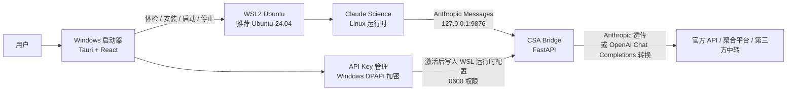

# CSA — Claude Science Assistant

Claude Science 的 Windows 启动器、WSL 运行时编排器与 API Bridge 管理面板。

[](https://github.com/Dalaoyuan2020/claude-science-assistant/releases/latest)
[](#快速开始)
[](https://tauri.app/)
[](https://github.com/Dalaoyuan2020/claude-science-assistant/releases)
[](LICENSE)

## v0.2.0 新功能

v0.2.0 新增两条本地优先链路：Connect 可把本人 Telegram/飞书私聊路由到当前 Claude Science 工作区并回传文本或受管 artifact 图片；Subagent 可让沙盒提交脱敏请求，经本地人工批准后交给 Claude Code plan 会话处理，并通过稳定 outbox 回读结果。

- [v0.2 新功能验收报告](docs/v0.2-new-features-acceptance.zh-CN.md)
- [v0.2 技术实现与发布审查](docs/v0.2-technology-and-release-review.zh-CN.md)
- [v0.2 安装、升级、打包与回退](docs/v0.2-install-upgrade-release-guide.zh-CN.md)

公开稳定版以 GitHub Latest Release 为准；安装或升级必须下载完整 ZIP 和同名 SHA-256 文件，不要只替换 EXE。

> 状态说明：可下载稳定版以 GitHub Latest Release 为准；`main` 可能包含下一版本的发布候选，安装或升级请始终下载完整 Release ZIP。

> 验证边界：v0.1.3 已在 Windows 11 10.0.22631 + Ubuntu-24.04 完成端到端验证；309/其他差异环境尚未完成本版本 DeepSeek thinking 全链路复测。

[下载最新版](https://github.com/Dalaoyuan2020/claude-science-assistant/releases/latest) · [第一次安装](#快速开始) · [从旧版升级](#从旧版升级) · [实现原理](#实现原理) · [Claude Science 绿皮书](https://github.com/Dalaoyuan2020/claude-science-green-book)

官方仓库：[Dalaoyuan2020/claude-science-assistant](https://github.com/Dalaoyuan2020/claude-science-assistant)  
配套阅读：[Claude Science 绿皮书](https://github.com/Dalaoyuan2020/claude-science-green-book)

CSA 是绿皮书第二章配套工具：在 Windows 上把 Claude Science 稳定启动起来，并接入 GLM、LongCat、DeepSeek、MiniMax、OpenCode Go、OpenRouter 以及自定义 OpenAI-compatible 中转。它不是新的大模型平台，也不是破解工具；它负责把 WSL、端口、模型名、API Key 和 Bridge 这些容易卡住的环节收进一个可视化启动器里。

## 为什么选择 CSA？

现代 Claude Science/Claude Code 科研工作流真正难的地方，往往不是“会不会写 Prompt”，而是第一步就被环境拦住：WSL2、Ubuntu、localhost 转发、运行时依赖、Provider 协议、模型名映射和 API Key 安全都要同时处理。

CSA 把这些步骤收口成一个桌面应用：

- 一个启动器，跑通 Windows 科研链路：体检电脑、安装/修复 WSL 运行时、启动 Claude Science 和本地 Bridge。
- 告别反复手改配置：API Key 通过模板添加，官方直连、聚合平台、第三方中转和自定义 Base URL 都在同一个入口管理。
- 先测试，再启用：保存前可测试 API Key 连通性，必要时读取 `/models` 自动生成 Claude 角色到上游模型的映射。
- 当前只激活一条 Key：已保存 Key 按添加顺序展示，首页聚焦“现在用什么、能不能启动、哪里出问题”。
- 默认保护隐私：API Key 使用 Windows 当前用户 DPAPI 加密，界面、日志、诊断包和发布包不应回显明文 Key。
- 面向新手，也保留工程入口：新手双击 BAT 和启动器即可开始；熟悉命令行的用户仍可使用 PowerShell 脚本和诊断报告。
- 本地双向 Connect：Telegram 私聊通过 WSL Gateway 和浏览器连接器进入真实 Claude Science 会话，完成回复由 Bridge 旁路回送；当前开发基线也支持把 Claude Science 明确生成的 artifact 图片安全回传 Telegram。MCP/Skill 与工作区文件保留为降级路线，不开放公网端口，也不接受远程 shell。

## v0.2.0 界面结构

首页把环境体检收口为可折叠的 2 行 × 3 列六项状态，不再把所有 Provider 或 API Key 平铺在首页：

| WSL2 | 运行时 | Bridge |
| --- | --- | --- |
| Claude Science | WSL 存储 | 当前 API Key |

“添加供应商”仍是唯一 Provider 新增入口，测试连通、模型列表和自动映射都在该对话框内完成。下方功能区可切换 API Key、Subagent、Connect 和 Research OS；Connect 与 Subagent 保持任务管理定位，不重复实现完整聊天客户端。

## v0.2.0 的六项核心能力

1. **六状态界面与存储体检**：首页改为可折叠的 2×3 六状态卡；“WSL 存储”显示 VHDX 的 Windows 位置、宿主盘余量、Linux 根分区余量和 VHDX 大小，并在空间不足、文件系统只读或 inode 紧张时告警/阻断危险重启。r2 增加“推荐迁移 / 辅助迁移”弹窗，按本机证据生成可复制给 Codex 的只读体检与迁移计划 Prompt。
2. **输出参数与工具调用适配**：正式请求不再注入统一的小输出值；调用方没有预算时让上游采用自身默认，o-series 使用 `max_completion_tokens`，并保留并行工具调用偏好。只有明确的 400/422 参数错误才做一次受限兼容重试。
3. **更多 Provider 与模型协议**：完成 DeepSeek、MiniMax 中国区、LongCat、OpenCode Go 等模板和模型发现/映射修正；DeepSeek 原生接口会把 Claude Science 的 `thinking.type=auto` 转为 `adaptive`。模型初始保持为空，只有手动输入、实时列表或真实短对话验证成功后才保存。
4. **并排增量升级**：旧用户不需要卸载 WSL、Ubuntu 或运行时。下载完整新 ZIP 到新目录，由新版验证并接管旧 Bridge；APPDATA 设置和同一 Windows 用户的 DPAPI Key 继续使用，旧目录保留到验收成功后再删除。
5. **Connect 双向链路**：本地 Go Gateway 通过 SQLite、Telegram 长轮询、飞书长连接、MCP 和浏览器插件，把已配对私聊路由到当前 Claude Science 工作区；消息状态、去重、半流式进度和图片回传均可审计。
6. **Subagent 沙盒外协作**：Claude Science 通过 External Agent Skill 提交脱敏请求，CSA 面板人工批准后打开 Claude Code plan 会话；session 可恢复，结果通过稳定 outbox 回到原项目。

同时保留以下基础能力：Windows 便携 EXE、统一“添加供应商”入口、API Key 测试连通与自动映射、DPAPI 加密、Bridge `source_path`/配置版本归属校验，以及 BAT/PowerShell 双入口。

> 存储迁移边界：v0.1.3 r2 已上线位置检测、C 盘专用预警、容量告警、危险操作阻断，以及只读的“辅助迁移 / 复制给 Codex”入口。启动器只生成本机化 Prompt，不执行 export/import、unregister、移动或重建 WSL；实际迁移仍是独立高风险流程和 `BUILD NO-GO`。

## 支持的 Provider

CSA 当前覆盖官方直连、聚合平台、第三方中转和自定义 OpenAI-compatible 接入：

| 类型 | 已内置模板 |
| --- | --- |
| 官方直连 | GLM-5.2、LongCat、DeepSeek、MiniMax、Claude、OpenAI / GPT |
| 聚合平台 | OpenCode Go、OpenRouter |
| 中转服务 | 项目方自建中转、自定义中转 |

`https://10521052.xyz/v1` 是项目方自建中转服务，不是模型厂商官方 API。CSA 将它作为便捷模板内置，但仍要求用户确认域名后才发送 API Key；自定义中转同样遵守这一保护。

## 与 Claude Science 绿皮书联动

CSA 是绿皮书“上手篇 §02 装上你的科研搭档”的 Windows 落地层。

| 读者状态 | 推荐入口 |
| --- | --- |
| 还不知道 Claude Science 能做什么 | 先读 [Claude Science 绿皮书](https://github.com/Dalaoyuan2020/claude-science-green-book) |
| Windows 用户，想先跑起来 | 下载 CSA Release，按本仓库教程安装 |
| 已经能启动，但不会接国产模型 | 看 CSA 的 API Key 与自动映射说明 |
| 已经跑通，想提高科研使用水平 | 回到绿皮书继续读 §03 之后的科研流程 |
| 想排查环境问题 | 使用 `bootstrap-claude-science-wsl` 体检 Skill 和 CSA 诊断报告脚本 |

更完整的联动文案见 [docs/green-book-integration.zh-CN.md](docs/green-book-integration.zh-CN.md)。

## 实现原理

CSA 采用“Windows 启动器 + WSL 运行时 + 本地 Bridge + 上游 Provider”的分层架构。



核心思想是：Windows 负责用户体验，WSL 负责运行 Claude Science 和 Bridge，Bridge 负责把 Claude Science 发出的 Anthropic-style 请求转换到上游模型。

| 层 | 做什么 | 为什么这样设计 |
| --- | --- | --- |
| Windows 启动器 | 展示状态、添加供应商、测试连通、启动/停止服务 | 普通用户双击即可使用，不需要手动进终端 |
| WSL 运行时 | 承载 Claude Science、Bridge、Python 依赖和运行日志 | 避免 Windows 与 WSL 同时跑两份 Bridge，只保留一份真正在跑的运行时 |
| CSA Bridge | 协议转换、模型映射、Provider 调用、健康检查 | 让 Claude Science 以熟悉的 Anthropic 接口工作 |
| Provider 模板 | 官方直连、聚合平台、第三方中转、自定义 Base URL | 降低模型接入门槛，同时保留高级用户自由度 |
| 体检 Skill | 只读检查、安装计划、修复、回滚 | 新电脑先诊断再改系统，减少“越修越乱” |

## Provider 默认顺序

添加供应商时，模板按这个顺序出现：

| 分组 | 模板 | 初始模型策略 |
| --- | --- | --- |
| 官方直连 | GLM-5.2 | 空；用户输入或从接口获取模型列表 |
| 官方直连 | LongCat | 空；用户输入或从接口获取模型列表 |
| 官方直连 | DeepSeek | 空；优先获取实时模型；列表不可用时仅尝试官方候选且必须真实对话成功 |
| 官方直连 | MiniMax | 空；获取实时模型后再生成主力/快速映射 |
| 官方直连 | Claude | 官方 API Key 或订阅登录（按官方规则） |
| 官方直连 | OpenAI / GPT | 空；OpenAI-compatible 接入后获取模型 |
| 聚合平台 | OpenCode Go | 空；仅在实时返回列表中按能力评分 |
| 聚合平台 | OpenRouter | 需要测试或手动选择可用模型 |
| 中转服务 | 项目方自建中转 | `https://10521052.xyz/v1` |
| 中转服务 | 自定义中转 | 用户自行填写 Base URL |

项目方自建中转不是模型厂商官方 API；内置仅表示提供固定入口，不表示跳过域名确认。自定义中转也必须由用户确认 Base URL 后才能发送 API Key。

所有 Provider 初始都不预填模型，也不在 `/v1/models` 伪造一组“看起来可用”的模型。只有用户手动填写、连接测试选中，或“自动映射”读取到真实模型列表后，模型与映射才会写入配置。

## 自动模型映射

Claude Science 侧通常会请求类似 `claude-sonnet-*`、`claude-opus-*`、`claude-haiku-*` 的模型名；国产模型或中转平台则使用自己的模型 ID。CSA 的自动映射用于把两边对齐。

规则简化为三句话：

1. 如果上游只返回一个可用聊天模型，就把所有 Claude 角色都映射到这个模型。
2. 如果上游返回多个模型，优先把 Pro、Max、大模型作为主力，把 Fast、Flash、Highspeed、Mini、Lite、Air 作为快速模型。
3. Provider 专属优先级主要用于给实时模型列表打分；只有经过资料核验的官方 Provider 才允许在列表不可用时尝试候选模型，而且必须真实对话成功后才能保存。第三方中转不会获得这种回退。

常见映射示例：

| Claude 侧角色 | CSA 映射意图 |
| --- | --- |
| `claude-sonnet-*` | 主力模型 |
| `claude-opus-*` | 主力模型 |
| `byok-model-0001` | 主力模型 |
| `claude-haiku-*` | 快速/低延迟模型 |

这不是要让用户手填一堆一一对应关系，而是让启动器先根据模型列表生成草案；用户确认后再保存。

## 选择你的使用路径

| 第一次安装 | 从旧版升级 |
| --- | --- |
| 下载完整 ZIP，先让 AI 助手只读体检；没有 WSL 时需单独确认系统安装 | 下载完整 ZIP，解压到新目录，让新版接管旧 Bridge；不重装 WSL/Ubuntu |
| 首次添加 API Key，并测试连通和模型映射 | 同电脑、同 Windows 用户通常保留已保存 Key；验收成功前保留旧目录 |
| [进入首次安装流程](#快速开始) | [进入升级流程](#从旧版升级) |

无论首次安装还是升级，都必须使用完整 ZIP。只复制 `claude-science-assistant.exe` 无法同步更新 Bridge、脚本、Skill 和内置 Linux 运行时。

## 快速开始

### 1. 下载

只从 GitHub Releases 下载官方包：

- `claude-science-assistant-v0.2.0-release-portable.zip`
- `claude-science-assistant-v0.2.0-release-portable.zip.sha256`

不要从群文件、网盘或第三方镜像下载带 `claude-science-assistant.exe` 的压缩包。

### 2. 解压

解压到一个固定目录。中文路径可以使用，但如果遇到权限或杀软误报，优先换到短路径，例如：

```text
D:\CSA
```

启动器解压目录本身不等于 WSL 虚拟磁盘位置。首页“WSL 存储”会显示真正占用空间的 VHDX 所在目录；大实验前请确认该宿主盘和 Linux 根分区都有足够余量。

不要只复制 exe。便携包里的 `scripts/`、`docs/`、`skills/`、`vendor/`、`static/` 等目录需要和 exe 放在一起。

### 3. 推荐方式：交给 AI 编程助手安装（推荐 Codex，也支持 Claude Code 等）

你不需要自己判断这是首次安装还是升级。推荐把解压后的 CSA 文件夹作为 Codex / Claude Code 等 AI 编程助手的工作区打开，然后把下面这段 Prompt 发给它：

```text
请读取当前 CSA 完整便携包中的
docs/prompts/csa-install-or-upgrade-agent-prompt.zh-CN.md，
严格执行其中的“第一阶段：只读识别场景”。

请先判断这是首次安装、已有 WSL 的首次接入、同用户升级，还是环境异常；
只向我输出证据、计划、会修改的路径、权限/重启要求和回滚办法。
在我明确确认前，不得安装、接管、停止服务、删除文件或修改系统。
```

完整 Prompt 见 [CSA 首次安装 / 升级通用 AI Prompt](docs/prompts/csa-install-or-upgrade-agent-prompt.zh-CN.md)。它会先根据证据区分首次安装与升级，再等待用户确认后执行。

### 4. 新电脑先预览安装计划

双击：

```text
1-run-acceptance-preview.bat
```

它只预览计划，不应直接安装或修改系统。

### 5. 根据电脑状态选择安装方式

这里要分清楚三件事：

| 类型 | 是否由双击流程完成 | 说明 |
| --- | --- | --- |
| 打开 CSA 启动器 | 是 | `claude-science-assistant.exe` 是便携程序，不需要 MSI 安装 |
| 安装/修复 CSA WSL 运行时 | 是，前提是电脑已有可用 WSL/Ubuntu | `4-install-runtime-after-preview.bat` 会安装/修复 Bridge、Python venv、内置 Claude Science Linux 运行时，并启动/自测 |
| 首次安装 WSL/Ubuntu | 不默认自动执行 | 需要管理员权限、额外确认 `-InstallWslIfMissing`，并可能要求重启；也可以交给 Codex 等 AI 编程助手按 Skill 引导执行 |

如果预览显示电脑已经有可用 WSL/Ubuntu，确认后再双击：

```text
4-install-runtime-after-preview.bat
```

如果预览提示没有 WSL/Ubuntu，不要把 `4-install-runtime-after-preview.bat` 当成静默系统安装器。此时有两种推荐方式：

1. 让 Codex（或其他 AI 编程助手）使用包内 `bootstrap-claude-science-wsl` Skill 继续处理，它会先解释需要启用的 Windows 功能、Ubuntu 版本、管理员权限和重启点。
2. 熟悉命令行的用户可在管理员 PowerShell 中显式运行带 `-InstallWslIfMissing` 的命令。

系统要求重启时，先重启；重启后重新运行体检/预览，再继续安装 CSA 运行时。

### 6. 启动 CSA

双击：

```text
claude-science-assistant.exe
```

首页应该显示 WSL、Bridge、Claude Science 和 Provider 状态。

### 7. 添加供应商

点击“添加供应商”：

1. 选择 Provider 模板。
2. 填入 API Key。
3. 对第三方中转确认 Base URL。
4. 点击“测试 API Key”。
5. 如 Provider 有多个模型，点击“自动映射”。
6. 保存并设为当前使用。

保存后点击“启动”或“打开 Claude Science”。

详细教程见 [docs/quick-start.zh-CN.md](docs/quick-start.zh-CN.md)。

## 从旧版升级

CSA 当前是便携版，不需要卸载旧版，也不要卸载 WSL、Ubuntu 或 Claude Science 运行时。推荐使用“并排升级”，不要把新文件零散覆盖到旧目录：

1. 先关闭旧版 CSA 启动器；正在运行的 Bridge / Claude Science 可以暂时保留。
2. 下载新版本完整 ZIP，解压到一个新的版本目录；不要只复制新的 exe。
3. 双击新目录中的 `claude-science-assistant.exe`。新版会读取当前 Windows 用户已有的加密设置，并识别 9876 端口是否仍由旧目录的 Bridge 占用。
4. 让新版执行启动/接管；它会停止属于旧目录的 Bridge，再从新目录启动并校验 `source_path` 和配置版本。
5. 确认首页显示 Bridge、Claude Science、当前 API Key 均正常，并完成一次模型连通测试。
6. 保留旧目录一段时间作为回退；确认稳定后再删除旧解压目录。

用户设置位于 `%APPDATA%\ClaudeScienceAssistant\settings.json`，WSL 运行时位于 Linux 用户目录，两者都不在便携包目录中。因此同一台电脑、同一 Windows 用户下升级时，已保存 Key 通常会继续存在；Key 仍受 DPAPI 保护，复制到另一台电脑或另一个 Windows 用户不会自动可用。

当前版本不做静默自动更新，也不在更新时自动迁移、注销、压缩或重建 WSL。后续若增加应用内更新，应至少具备：下载包校验 SHA256、设置 schema 迁移、更新前备份、启动后健康验收和一键回退，缺一项都不应直接替换正在使用的版本。

## 联系与答疑

如果你在安装、API Key 接入、模型映射或 Claude Science 科研工作流里遇到问题，可以通过下面两个入口联系：

| 入口 | 用途 |
| --- | --- |
| 个人微信 | 一对一答疑与安装协助；复杂问题可预约有偿咨询与后续使用指导 |
| Claude Science 绿皮书答疑群 | 公开答疑、共性问题讨论、绿皮书与 CSA 使用交流 |

| 个人微信 | 答疑群 |
| --- | --- |
|  |  |

> 群二维码可能会过期；如果群二维码失效，请先添加个人微信获取新的入群方式。

## 安全与隐私边界

CSA 的默认策略是尽量少动系统、少暴露秘密：

- 不修改 Clash、VPN、DNS、hosts、系统代理、根证书或 443 端口。
- API Key 使用 Windows 当前用户 DPAPI 加密保存。
- DPAPI 绑定当前 Windows 用户和当前电脑；复制便携包到另一台电脑不会带走 Key。
- 当前激活的 Key 会写入 WSL 运行时配置，供 Bridge 调用上游模型使用；该文件应保持 `0600` 权限。
- 日志、诊断包、文档、README、Release 说明不应包含明文 API Key。
- 分享问题截图或诊断包前，仍建议人工检查一次。

如果你要提交 issue，请不要粘贴真实 API Key、OAuth token、完整 Cookie、完整日志或包含隐私内容的 Prompt。

## 常见问题

### 为什么不是纯 Windows 运行？

当前真实主链路是 Claude Science 在 WSL 中运行。把 Bridge、运行时和日志都收口到 WSL，可以避免 Windows 与 WSL 同时跑两份 Bridge，造成“面板显示成功但实际请求没切换”的问题。

### 为什么推荐 Ubuntu-24.04，但又说兼容其他版本？

Ubuntu-24.04 是默认推荐测试路径，便于复现问题；但启动器不应因为用户已有其他 Ubuntu/WSL 发行版就直接阻断。v0.1.3 的策略是“推荐 24.04，兼容已安装可用发行版”。

### 项目方自建中转是不是模型厂商官方服务？

不是。`https://10521052.xyz/v1` 由 CSA 项目方自建和维护，用于提供便捷的模型中转入口，但不属于 Claude、DeepSeek、OpenAI 等模型厂商的官方 API。使用前仍需确认域名与服务条款。

### Claude / OpenAI 的订阅能不能当 API Key 用？

不能默认这样理解。订阅权益、网页登录和 API Key 是不同入口。CSA 只在对应 Provider 模板里处理它能实际调用的接口能力。

### API Key 列表为什么不把所有 Provider 都放首页？

首页只应该显示“当前正在使用什么”和“现在能不能启动”。所有新增 Provider、测试、自动映射都放在“添加供应商”对话框里，避免把用户推到一堆并列配置面板前。

### 出问题先做什么？

先不要反复双击 exe。优先做三件事：

1. 在 CSA 里刷新状态。
2. 运行诊断报告脚本（BAT），自动生成脱敏报告。
3. 让 Codex 等 AI 助手使用体检 Skill 重新检查环境。

排错指南见 [docs/troubleshooting.md](docs/troubleshooting.md)。

## 文档导航

| 文档 | 用途 |
| --- | --- |
| [docs/quick-start.zh-CN.md](docs/quick-start.zh-CN.md) | 新手完整接入流程 |
| [docs/architecture-and-product-plan.zh-CN.md](docs/architecture-and-product-plan.zh-CN.md) | 架构、风险审计、产品任务书 |
| [docs/provider-access-matrix.zh-CN.md](docs/provider-access-matrix.zh-CN.md) | Provider 接入矩阵 |
| [docs/github-release-v0.2.0.md](docs/github-release-v0.2.0.md) | v0.2.0 GitHub Release 文案 |
| [docs/v0.2-new-features-acceptance.zh-CN.md](docs/v0.2-new-features-acceptance.zh-CN.md) | Connect 与 Subagent 验收矩阵 |
| [docs/v0.2-technology-and-release-review.zh-CN.md](docs/v0.2-technology-and-release-review.zh-CN.md) | v0.2 技术实现、安全边界与发布审查 |
| [docs/v0.2-install-upgrade-release-guide.zh-CN.md](docs/v0.2-install-upgrade-release-guide.zh-CN.md) | 新装、并排升级、回退和发布流程 |
| [docs/github-release-v0.1.3.md](docs/github-release-v0.1.3.md) | v0.1.3 GitHub Release 文案 |
| [docs/v0.1.3-update-record.zh-CN.md](docs/v0.1.3-update-record.zh-CN.md) | v0.1.3 相对 v0.1.2 的完整更新记录 |
| [docs/retrospectives/2026-07-12-csa-v0.1.3-release-retrospective.zh-CN.md](docs/retrospectives/2026-07-12-csa-v0.1.3-release-retrospective.zh-CN.md) | v0.1.3 当日开发、验收与发布复盘，可作为文章素材 |
| [docs/prompts/csa-install-or-upgrade-agent-prompt.zh-CN.md](docs/prompts/csa-install-or-upgrade-agent-prompt.zh-CN.md) | 首次安装 / 升级通用 AI Prompt |
| [docs/plans/wsl-storage-migration-context-checkpoint.zh-CN.md](docs/plans/wsl-storage-migration-context-checkpoint.zh-CN.md) | WSL 存储检测、预警、Prompt 入口与迁移执行的当前真实状态 |
| [docs/prompts/csa-wsl-storage-migration-codex-prompt.zh-CN.md](docs/prompts/csa-wsl-storage-migration-codex-prompt.zh-CN.md) | WSL 存储辅助迁移的只读体检与计划生成 Prompt |
| [docs/green-book-integration.zh-CN.md](docs/green-book-integration.zh-CN.md) | 与 Claude Science 绿皮书联动说明 |
| [docs/connect-gateway-implementation.zh-CN.md](docs/connect-gateway-implementation.zh-CN.md) | Connect 当前架构、状态机与安全边界 |
| [docs/plans/csa-connect-message-media-v3-plan.zh-CN.md](docs/plans/csa-connect-message-media-v3-plan.zh-CN.md) | 下一阶段上下文瘦身、单次投递与图片传输计划 |
| [docs/troubleshooting.md](docs/troubleshooting.md) | 常见问题与排错 |
| [docs/v0.1-current-pc-verification.zh-CN.md](docs/v0.1-current-pc-verification.zh-CN.md) | v0.1.3 发布候选的本机证据与剩余发布门槛 |

## 开发与验证

面向开发者的常用检查：

```powershell
.\scripts\self-test.ps1
Push-Location launcher
pnpm tauri build --debug --no-bundle
Pop-Location
.\scripts\package-launcher-portable.ps1 -Profile debug -SkipBuild
```

发布前至少确认：

- 前端构建通过。
- Rust 测试通过。
- Bridge self-test 通过。
- 便携包安装预览通过。
- 仓库和发布包中没有 `sk-...` 形式的真实 API Key。

## 许可

本仓库按 [LICENSE](LICENSE) 发布。如果将来引入或改写第三方项目代码，需要保留对应项目的许可证和著作权声明。
