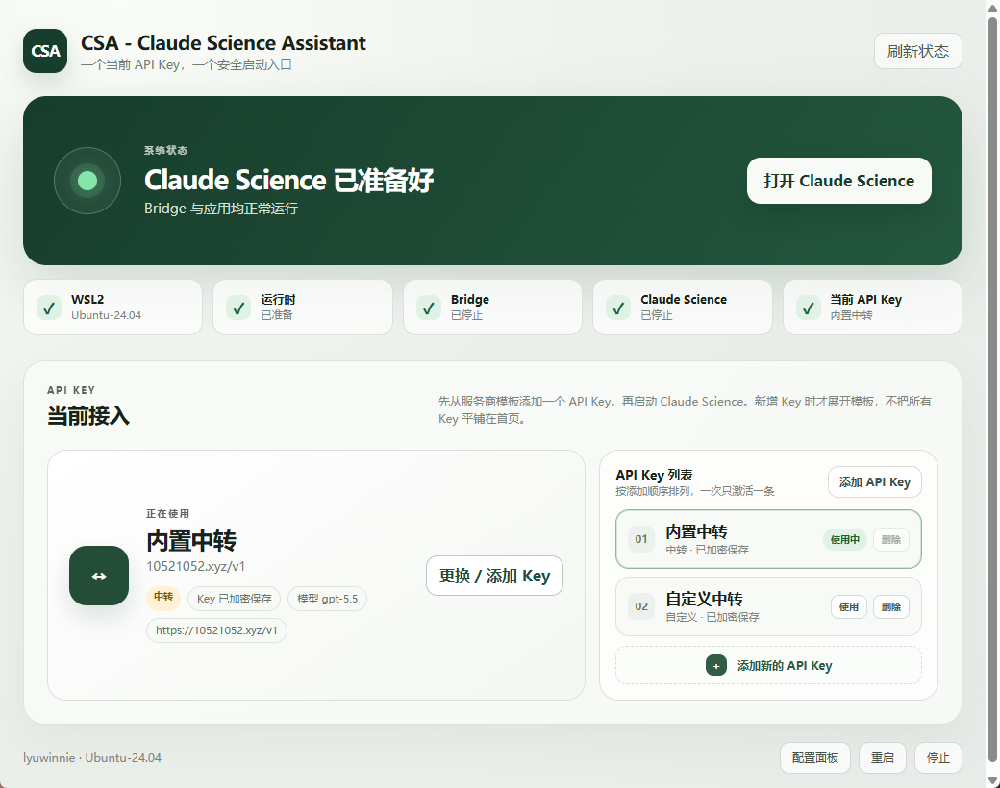
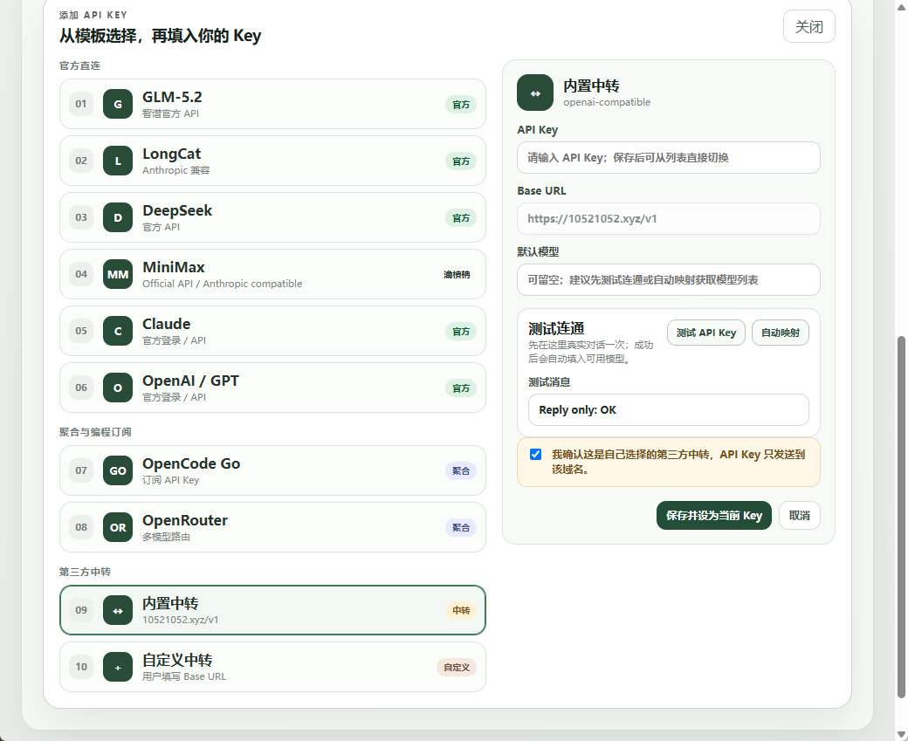
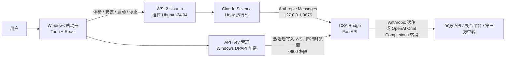

# CSA — Claude Science Assistant

Claude Science 的 Windows 启动器、WSL 运行时编排器与 API Bridge 管理面板。

[](https://github.com/Dalaoyuan2020/claude-science-assistant/releases)
[](#快速开始)
[](https://tauri.app/)
[](https://github.com/Dalaoyuan2020/claude-science-assistant/releases)
[](LICENSE)

官方仓库：[Dalaoyuan2020/claude-science-assistant](https://github.com/Dalaoyuan2020/claude-science-assistant)  
配套阅读：[Claude Science 绿皮书](https://github.com/Dalaoyuan2020/claude-science-green-book)

CSA 是绿皮书第二章配套工具：在 Windows 上把 Claude Science 稳定启动起来，并接入 GLM、LongCat、DeepSeek、MiniMax、OpenCode Go、OpenRouter 以及自定义 OpenAI-compatible 中转。它不是新的大模型平台，也不是破解工具；它负责把 WSL、端口、模型名、API Key 和 Bridge 这些容易卡住的环节收进一个可视化启动器里。

## 为什么选择 CSA？

现代 Claude Science/Claude Code 科研工作流真正难的地方，往往不是“会不会写 Prompt”，而是第一步就被环境拦住：WSL2、Ubuntu、localhost 转发、运行时依赖、Provider 协议、模型名映射和 API Key 安全都要同时处理。

CSA 把这些步骤收口成一个桌面应用：

- 一个启动器，跑通 Windows 科研链路：体检电脑、安装/修复 WSL 运行时、启动 Claude Science 和本地 Bridge。
- 告别反复手改配置：API Key 通过模板添加，官方直连、聚合平台、第三方中转和自定义 Base URL 都在同一个入口管理。
- 先测试，再启用：保存前可测试 API Key 连通性，必要时读取 `/models` 自动生成 Claude 角色到上游模型的映射。
- 当前只激活一条 Key：已保存 Key 按添加顺序展示，首页聚焦“现在用什么、能不能启动、哪里出问题”。
- 默认保护隐私：API Key 使用 Windows 当前用户 DPAPI 加密，界面、日志、诊断包和发布包不应回显明文 Key。
- 面向新手，也保留工程入口：新手双击 BAT 和启动器即可开始；熟悉命令行的用户仍可使用 PowerShell 脚本和诊断报告。

## 界面预览

| 主界面 | 添加供应商 |
| --- | --- |
|  |  |

## v0.1.2 做到了什么

- Windows 便携启动器：双击 `claude-science-assistant.exe` 使用。
- WSL 单运行时路线：推荐 Ubuntu-24.04，同时兼容已安装的 Ubuntu/WSL 发行版。
- API Key 列表：首页按添加顺序显示已保存 Key，当前只激活一条。
- “添加供应商”模板入口：官方、聚合、中转、自定义在同一个入口选择。
- API Key 加密保存：使用 Windows 当前用户 DPAPI；界面、日志、发布包不回显明文 Key。
- 测试连通：在启动器里直接测试 API Key，不必跳到 Claude Science 项目里试错。
- 自动模型映射：读取 `/models` 后自动生成主力/快速模型映射。
- DeepSeek、LongCat、MiniMax、OpenCode Go 兼容修正。
- BAT 与 PowerShell 脚本并存：新手可双击 BAT，熟悉命令行的用户可继续用 PS1。

## 支持的 Provider

CSA 当前覆盖官方直连、聚合平台、第三方中转和自定义 OpenAI-compatible 接入：

| 类型 | 已内置模板 |
| --- | --- |
| 官方直连 | GLM-5.2、LongCat、DeepSeek、MiniMax、Claude、OpenAI / GPT |
| 聚合平台 | OpenCode Go、OpenRouter |
| 第三方中转 | 内置中转、自定义中转 |

第三方中转不会默认信任。CSA 会要求用户确认域名后，才会把 API Key 发往该地址。

## 与 Claude Science 绿皮书联动

CSA 是绿皮书“上手篇 §02 装上你的科研搭档”的 Windows 落地层。

| 读者状态 | 推荐入口 |
| --- | --- |
| 还不知道 Claude Science 能做什么 | 先读 [Claude Science 绿皮书](https://github.com/Dalaoyuan2020/claude-science-green-book) |
| Windows 用户，想先跑起来 | 下载 CSA Release，按本仓库教程安装 |
| 已经能启动，但不会接国产模型 | 看 CSA 的 API Key 与自动映射说明 |
| 已经跑通，想提高科研使用水平 | 回到绿皮书继续读 §03 之后的科研流程 |
| 想排查环境问题 | 使用 `bootstrap-claude-science-wsl` 体检 Skill 和 CSA 诊断报告脚本 |

更完整的联动文案见 [docs/green-book-integration.zh-CN.md](docs/green-book-integration.zh-CN.md)。

## 实现原理

CSA 采用“Windows 启动器 + WSL 运行时 + 本地 Bridge + 上游 Provider”的分层架构。



核心思想是：Windows 负责用户体验，WSL 负责运行 Claude Science 和 Bridge，Bridge 负责把 Claude Science 发出的 Anthropic-style 请求转换到上游模型。

| 层 | 做什么 | 为什么这样设计 |
| --- | --- | --- |
| Windows 启动器 | 展示状态、添加供应商、测试连通、启动/停止服务 | 普通用户双击即可使用，不需要手动进终端 |
| WSL 运行时 | 承载 Claude Science、Bridge、Python 依赖和运行日志 | 避免 Windows 与 WSL 同时跑两份 Bridge，只保留一份真正在跑的运行时 |
| CSA Bridge | 协议转换、模型映射、Provider 调用、健康检查 | 让 Claude Science 以熟悉的 Anthropic 接口工作 |
| Provider 模板 | 官方直连、聚合平台、第三方中转、自定义 Base URL | 降低模型接入门槛，同时保留高级用户自由度 |
| 体检 Skill | 只读检查、安装计划、修复、回滚 | 新电脑先诊断再改系统，减少“越修越乱” |

## Provider 默认顺序

添加供应商时，模板按这个顺序出现：

| 分组 | 模板 | 默认/推荐模型 |
| --- | --- | --- |
| 官方直连 | GLM-5.2 | `glm-5.2` |
| 官方直连 | LongCat | `LongCat-2.0` |
| 官方直连 | DeepSeek | `deepseek-v4-pro`，快速映射 `deepseek-v4-flash` |
| 官方直连 | MiniMax | `MiniMax-M3`，快速映射 `MiniMax-M2.7-highspeed` |
| 官方直连 | Claude | 官方 API Key 或订阅登录（按官方规则） |
| 官方直连 | OpenAI / GPT | OpenAI-compatible 接入 |
| 聚合平台 | OpenCode Go | 默认 `glm-5.2`；主力候选 `glm-5.2` → `qwen3.7-max` → `deepseek-v4-pro`；快速 `deepseek-v4-flash` |
| 聚合平台 | OpenRouter | 需要测试或手动选择可用模型 |
| 第三方中转 | 内置中转 | `https://10521052.xyz/v1` |
| 第三方中转 | 自定义中转 | 用户自行填写 Base URL |

第三方中转不会默认信任。CSA 会要求用户确认域名后，才会把 API Key 发往该地址。

## 自动模型映射

Claude Science 侧通常会请求类似 `claude-sonnet-*`、`claude-opus-*`、`claude-haiku-*` 的模型名；国产模型或中转平台则使用自己的模型 ID。CSA 的自动映射用于把两边对齐。

规则简化为三句话：

1. 如果上游只返回一个可用聊天模型，就把所有 Claude 角色都映射到这个模型。
2. 如果上游返回多个模型，优先把 Pro、Max、大模型作为主力，把 Fast、Flash、Highspeed、Mini、Lite、Air 作为快速模型。
3. 如果 Provider 有已知最佳实践，就使用 Provider 专属优先级，例如 OpenCode Go 优先 `glm-5.2`，DeepSeek 快速角色优先 `deepseek-v4-flash`。

常见映射示例：

| Claude 侧角色 | CSA 映射意图 |
| --- | --- |
| `claude-sonnet-*` | 主力模型 |
| `claude-opus-*` | 主力模型 |
| `byok-model-0001` | 主力模型 |
| `claude-haiku-*` | 快速/低延迟模型 |

这不是要让用户手填一堆一一对应关系，而是让启动器先根据模型列表生成草案；用户确认后再保存。

## 快速开始

### 1. 下载

只从 GitHub Releases 下载官方包：

- `claude-science-assistant-v0.1.2-release-portable.zip`
- `claude-science-assistant-v0.1.2-release-portable.zip.sha256`

不要从群文件、网盘或第三方镜像下载带 `claude-science-assistant.exe` 的压缩包。

### 2. 解压

解压到一个固定目录。中文路径可以使用，但如果遇到权限或杀软误报，优先换到短路径，例如：

```text
C:\CSA
```

不要只复制 exe。便携包里的 `scripts/`、`docs/`、`skills/`、`vendor/`、`static/` 等目录需要和 exe 放在一起。

### 3. 推荐方式：交给 AI 编程助手安装（推荐 Codex，也支持 Claude Code 等）

你不需要自己理解 WSL、PowerShell 参数和脚本路径。推荐把解压后的 CSA 文件夹作为 Codex / Claude Code 等 AI 编程助手的工作区打开，然后把下面这段 Prompt 发给它（下文以 Codex 为例，其他助手同样适用）：

```text
请你帮我在这台 Windows 电脑上安装并启动 CSA（Claude Science Assistant）。

请先阅读当前文件夹里的 README.md、docs/quick-start.zh-CN.md、docs/v0.1-clean-pc-acceptance.zh-CN.md，以及 skills/bootstrap-claude-science-wsl/SKILL.md。

要求：
1. 先只读体检和预览，不要安装、删除、重启或修改系统。
2. 先运行 1-run-acceptance-preview.bat，或使用 bootstrap-claude-science-wsl Skill 做只读检查。
3. 判断这台电脑是否已有可用 WSL/Ubuntu。
4. 如果已有 WSL/Ubuntu，请向我说明将要安装/修复的 CSA WSL 运行时，然后等我确认后再执行 4-install-runtime-after-preview.bat。
5. 如果没有 WSL/Ubuntu，请不要静默安装。先告诉我需要管理员权限、可能启用的 Windows 功能、推荐 Ubuntu 版本和是否可能重启；只有我明确同意后，才可以使用 -InstallWslIfMissing。
6. 不要修改 Clash、VPN、DNS、hosts、系统代理、根证书或 443 端口。
7. 不要输出、保存、截图或提交我的 API Key、OAuth token、Cookie 或控制 token。
8. 安装或修复完成后，打开 claude-science-assistant.exe，指导我添加供应商、测试 API Key 连通性和自动映射模型。
9. 如果失败，请生成脱敏诊断摘要，告诉我卡在哪一步，以及下一步需要我确认什么。
```

这段 Prompt 的核心是：让 AI 助手先读文档、先体检、先预览；只有你确认后才安装或修复。

### 4. 新电脑先预览安装计划

双击：

```text
1-run-acceptance-preview.bat
```

它只预览计划，不应直接安装或修改系统。

### 5. 根据电脑状态选择安装方式

这里要分清楚三件事：

| 类型 | 是否由双击流程完成 | 说明 |
| --- | --- | --- |
| 打开 CSA 启动器 | 是 | `claude-science-assistant.exe` 是便携程序，不需要 MSI 安装 |
| 安装/修复 CSA WSL 运行时 | 是，前提是电脑已有可用 WSL/Ubuntu | `4-install-runtime-after-preview.bat` 会安装/修复 Bridge、Python venv、内置 Claude Science Linux 运行时，并启动/自测 |
| 首次安装 WSL/Ubuntu | 不默认自动执行 | 需要管理员权限、额外确认 `-InstallWslIfMissing`，并可能要求重启；也可以交给 Codex 等 AI 编程助手按 Skill 引导执行 |

如果预览显示电脑已经有可用 WSL/Ubuntu，确认后再双击：

```text
4-install-runtime-after-preview.bat
```

如果预览提示没有 WSL/Ubuntu，不要把 `4-install-runtime-after-preview.bat` 当成静默系统安装器。此时有两种推荐方式：

1. 让 Codex（或其他 AI 编程助手）使用包内 `bootstrap-claude-science-wsl` Skill 继续处理，它会先解释需要启用的 Windows 功能、Ubuntu 版本、管理员权限和重启点。
2. 熟悉命令行的用户可在管理员 PowerShell 中显式运行带 `-InstallWslIfMissing` 的命令。

系统要求重启时，先重启；重启后重新运行体检/预览，再继续安装 CSA 运行时。

### 6. 启动 CSA

双击：

```text
claude-science-assistant.exe
```

首页应该显示 WSL、Bridge、Claude Science 和 Provider 状态。

### 7. 添加供应商

点击“添加供应商”：

1. 选择 Provider 模板。
2. 填入 API Key。
3. 对第三方中转确认 Base URL。
4. 点击“测试 API Key”。
5. 如 Provider 有多个模型，点击“自动映射”。
6. 保存并设为当前使用。

保存后点击“启动”或“打开 Claude Science”。

详细教程见 [docs/quick-start.zh-CN.md](docs/quick-start.zh-CN.md)。

## 联系与答疑

如果你在安装、API Key 接入、模型映射或 Claude Science 科研工作流里遇到问题，可以通过下面两个入口联系：

| 入口 | 用途 |
| --- | --- |
| 个人微信 | 一对一答疑与安装协助；复杂问题可预约有偿咨询与后续使用指导 |
| Claude Science 绿皮书答疑群 | 公开答疑、共性问题讨论、绿皮书与 CSA 使用交流 |

| 个人微信 | 答疑群 |
| --- | --- |
|  |  |

> 群二维码可能会过期；如果群二维码失效，请先添加个人微信获取新的入群方式。

## 安全与隐私边界

CSA 的默认策略是尽量少动系统、少暴露秘密：

- 不修改 Clash、VPN、DNS、hosts、系统代理、根证书或 443 端口。
- API Key 使用 Windows 当前用户 DPAPI 加密保存。
- DPAPI 绑定当前 Windows 用户和当前电脑；复制便携包到另一台电脑不会带走 Key。
- 当前激活的 Key 会写入 WSL 运行时配置，供 Bridge 调用上游模型使用；该文件应保持 `0600` 权限。
- 日志、诊断包、文档、README、Release 说明不应包含明文 API Key。
- 分享问题截图或诊断包前，仍建议人工检查一次。

如果你要提交 issue，请不要粘贴真实 API Key、OAuth token、完整 Cookie、完整日志或包含隐私内容的 Prompt。

## 常见问题

### 为什么不是纯 Windows 运行？

当前真实主链路是 Claude Science 在 WSL 中运行。把 Bridge、运行时和日志都收口到 WSL，可以避免 Windows 与 WSL 同时跑两份 Bridge，造成“面板显示成功但实际请求没切换”的问题。

### 为什么推荐 Ubuntu-24.04，但又说兼容其他版本？

Ubuntu-24.04 是默认推荐测试路径，便于复现问题；但启动器不应因为用户已有其他 Ubuntu/WSL 发行版就直接阻断。v0.1.2 的策略是“推荐 24.04，兼容已安装可用发行版”。

### 内置中转是不是官方服务？

不是。`https://10521052.xyz/v1` 是内置模板，方便测试和临时接入，但属于第三方中转。CSA 会把它归在“第三方中转”里，并要求用户确认域名。

### Claude / OpenAI 的订阅能不能当 API Key 用？

不能默认这样理解。订阅权益、网页登录和 API Key 是不同入口。CSA 只在对应 Provider 模板里处理它能实际调用的接口能力。

### API Key 列表为什么不把所有 Provider 都放首页？

首页只应该显示“当前正在使用什么”和“现在能不能启动”。所有新增 Provider、测试、自动映射都放在“添加供应商”对话框里，避免把用户推到一堆并列配置面板前。

### 出问题先做什么？

先不要反复双击 exe。优先做三件事：

1. 在 CSA 里刷新状态。
2. 运行诊断报告脚本（BAT），自动生成脱敏报告。
3. 让 Codex 等 AI 助手使用体检 Skill 重新检查环境。

排错指南见 [docs/troubleshooting.md](docs/troubleshooting.md)。

## 文档导航

| 文档 | 用途 |
| --- | --- |
| [docs/quick-start.zh-CN.md](docs/quick-start.zh-CN.md) | 新手完整接入流程 |
| [docs/architecture-and-product-plan.zh-CN.md](docs/architecture-and-product-plan.zh-CN.md) | 架构、风险审计、产品任务书 |
| [docs/provider-access-matrix.zh-CN.md](docs/provider-access-matrix.zh-CN.md) | Provider 接入矩阵 |
| [docs/github-release-v0.1.2.md](docs/github-release-v0.1.2.md) | v0.1.2 GitHub Release 文案 |
| [docs/green-book-integration.zh-CN.md](docs/green-book-integration.zh-CN.md) | 与 Claude Science 绿皮书联动说明 |
| [docs/troubleshooting.md](docs/troubleshooting.md) | 常见问题与排错 |

## 开发与验证

面向开发者的常用检查：

```powershell
.\scripts\self-test.ps1
Push-Location launcher
pnpm tauri build --debug --no-bundle
Pop-Location
.\scripts\package-launcher-portable.ps1 -Profile debug -SkipBuild
```

发布前至少确认：

- 前端构建通过。
- Rust 测试通过。
- Bridge self-test 通过。
- 便携包安装预览通过。
- 仓库和发布包中没有 `sk-...` 形式的真实 API Key。

## 许可

本仓库按 [LICENSE](LICENSE) 发布。如果将来引入或改写第三方项目代码，需要保留对应项目的许可证和著作权声明。
