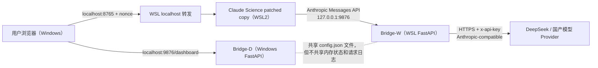
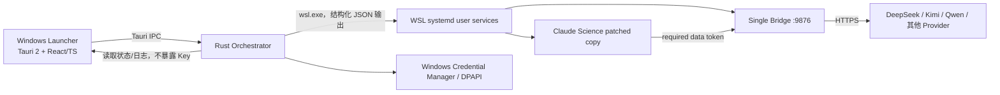

# Claude Science 国模桥接系统：现状架构、风险审计与产品任务书

本文记录 2026-07-04 在当前 Windows 机器上核验到的真实运行状态，并给出“电脑体检 Skill + Windows 启动器 + 管理面板”的产品化路线。它描述的是代码和运行证据，不把理想设计误写成现状。

> 历史快照说明：第 1-3 节保留 2026-07-04 发现双 Bridge 时的 As-Is 证据，用于解释产品决策，不代表 v0.1.3 当前运行状态。当前实现、验证结果和剩余门槛以 [v0.1-current-pc-verification.zh-CN.md](v0.1-current-pc-verification.zh-CN.md) 为准。

## 1. 结论先行

当前系统已经能用，实际主链路是：

```text
Windows 浏览器
  -> WSL localhost 转发 :8765
  -> WSL2 Ubuntu 24.04 中的 Claude Science（复制并补丁后的 Linux 二进制）
  -> WSL 内 FastAPI Bridge :9876
  -> DeepSeek 原生 Anthropic 兼容接口
```

口述中的 “WLS / SSLW” 应为 **WSL2**；它是 Windows 的 Linux 子系统，底层使用轻量虚拟机，但不等同于用户自行维护的一台普通 Windows 虚拟机。口述中的 “CloudSense” 与仓库代码对应的是 **Claude Science**，产品命名前需要最终确认是否要使用 CloudSense 作为自有品牌名。

当前最值得优先修复的不是界面，而是三个结构问题：

1. Windows 与 WSL 同时运行两份 Bridge，形成 split-brain（双实例分叉）。
2. 控制面 `/api/*` 无鉴权并允许任意网页跨域访问，本机 API Key 和费用额度存在被滥用的路径。
3. Windows 面板操作的实例不是 Claude Science 实际调用的实例，配置和日志会出现“显示成功但实际未生效”。

因此产品化顺序应是：**单实例与安全收口 → 极简启动器 → 体检 Skill → 自动安装 → 完整管理面板**。

## 2. 当前真实架构（As-Is）

### 2.1 运行拓扑



### 2.2 2026-07-04 实机证据

| 项目 | 已观察状态 |
|---|---|
| Windows | 64 位 Windows，内部版本 22631 |
| WSL | WSL2，`Ubuntu-24.04` 正在运行 |
| Claude Science | WSL 中的 patched copy，监听 `127.0.0.1:8765` 与 `8766` |
| WSL Bridge | WSL Python 进程监听 `127.0.0.1:9876`，有真实 DeepSeek 成功请求日志 |
| Windows Bridge | 另一 Windows Python 进程也监听 Windows `127.0.0.1:9876` |
| Provider | `deepseek`，上游模式为 `anthropic` |
| 当前模型 | 强制模型为 `claude-opus-4-8`，配置 4 个别名 |
| 控制面鉴权 | `proxy_auth_mode=optional`，无 token |
| Windows 自启动 | 没有发现 `ClaudeScienceByokProxy` 计划任务；当前 Windows 进程不是项目 `.venv` 启动 |
| 自动测试 | 27 个翻译/协议测试通过 |

### 2.3 请求如何完成

1. `scripts/start-claude-science-wsl.ps1` 选择固定的 WSL 发行版和用户，并调用 WSL shell 脚本。
2. `scripts/start-claude-science-wsl.sh` 检查 WSL 的 `9876`；未监听时启动 WSL Bridge。
3. 脚本复制 `~/.local/bin/claude-science` 到专用目录，对副本中的 Anthropic/OAuth URL 做等长字节替换，不修改原始二进制。
4. `setup-token.py` 根据 Claude Science 的 `encryption.key` 写入本地假 OAuth token。
5. patched Claude Science 以 `serve --port 8765 --no-browser --detached` 启动。
6. Claude Science 将 `/v1/messages` 发给 WSL Bridge。
7. `proxy.py` 选择 Provider。当前 DeepSeek 使用原生 Anthropic 模式，所以 Bridge 主要替换模型和鉴权头并透传；OpenAI-compatible Provider 才走 Anthropic ↔ OpenAI 协议转换。
8. Windows 通过 WSL 的 localhost 转发访问 `8765`。

### 2.4 代码模块

| 模块 | 作用 | 当前问题 |
|---|---|---|
| `proxy.py` | FastAPI 控制面、协议转换、模型路由、Provider 调用 | 控制面与数据面混在一个进程；鉴权、配置写入和跨域策略过宽 |
| `static/dashboard.html` | Provider 配置、健康状态、日志 | 连接到 Windows 实例时看不到 WSL 真实状态；日志渲染存在注入风险 |
| `setup-token.py` | 生成 Claude Science 可读取的假 OAuth token | 依赖应用内部格式，升级兼容性脆弱 |
| `start-claude-science-wsl.*` | 启动 WSL Bridge、补丁副本和 Claude Science | 发行版/用户名硬编码；用进程名批量停止；无统一 PID/状态文件 |
| `install-safe.ps1` | Windows Python、计划任务和用户环境变量安装 | 安装的是 Windows Bridge 路线，不是当前真实使用的 WSL 路线 |
| `doctor.ps1` | Windows 只读检查 | 未完整检查 WSL 内二进制、服务、补丁版本和双实例冲突；会直接打印部分敏感 URL |

## 3. 风险与冗余审计

### 3.1 P0：产品化前必须修复

| 编号 | 风险 | 证据与影响 | 修复方向 |
|---|---|---|---|
| SEC-001 | 控制面无鉴权且 CORS 允许任意 Origin | 对任意 Origin 请求 `/api/config` 会返回允许跨域；`/api/*` 被中间件明确设为鉴权旁路。恶意网页可改 Provider Base URL、触发本地请求或消耗额度 | 控制面仅接受 launcher 生成的会话凭证；限制 Origin/Host；移除通配 CORS；状态变更接口校验 CSRF token |
| SEC-002 | 数据面默认无鉴权 | 任意本机进程或可能访问 localhost 的网页可借用户 API Key 调用模型，造成费用滥用 | 首次安装自动生成高熵 token；数据面默认 required；限制请求体与速率 |
| SEC-003 | Dashboard DOM 注入 | `recent-requests` 中可控的 model/path 被模板字符串写入 `innerHTML` | 全部改用 `textContent`/安全组件渲染；加入恶意 model 回归测试和 CSP |
| ARC-001 | Windows/WSL 双 Bridge | 两个 `9876` 进程拥有独立内存配置和日志 | 明确唯一运行位置为 WSL；Windows 启动器只做编排和 UI |
| ARC-002 | 面板与真实请求实例分离 | Windows 日志只有 dashboard 轮询，WSL 日志才有真实 DeepSeek 请求 | 控制面必须代理到唯一 WSL 服务，或由 launcher 通过 IPC 读取 WSL 状态 |
| CFG-001 | 配置修改不热加载、不原子、无并发锁 | Windows 保存文件只更新 Windows 进程内存；WSL 仍使用旧对象。双进程还可能竞态覆盖文件 | 单一配置所有者；临时文件 + fsync + rename；schema 校验；版本号；明确 reload/restart 事务 |

SEC-001 与 SEC-002 的组合尤其危险：攻击者不需要先读出完整 Key，只要把现有 Provider Base URL 改到自己的服务，下一次请求的鉴权头就可能把 Key 带过去。

### 3.2 P1：MVP 同期处理

| 编号 | 问题 | 影响 | 修复方向 |
|---|---|---|---|
| LIFE-001 | 无可靠进程所有权 | 当前 Windows Bridge 来自非项目 Python，计划任务不存在；启动器难以判断“谁启动了谁” | 每个服务使用 PID + 启动时间 + 可执行文件哈希；只停止自己管理的进程 |
| LIFE-002 | `pgrep -f` 范围过宽 | 可能停止其他 Claude Science 会话 | 只操作 patched binary 的精确路径或 systemd user service |
| PORT-001 | WSL 发行版、用户名硬编码 | 换电脑几乎必坏 | 自动枚举发行版和默认用户，把选择写入设备级配置 |
| PATCH-001 | 二进制等长字节补丁脆弱 | Claude Science 更新后字符串变化即无法启动；存在兼容及合规风险 | 记录受支持版本和 SHA-256；补丁前置兼容检查；保留原文件；失败即停止；评估官方配置入口 |
| SECRET-001 | API Key 明文保存在项目目录 | 备份、同步、误共享或本机恶意进程可读取 | MVP 至少迁到 WSL home 的 `0600` 配置；正式版使用 Windows Credential Manager/DPAPI，并避免在日志和命令行出现 Key |
| SSRF-001 | Base URL 与 test-backend 缺少约束 | 控制面可请求任意地址并携带用户输入的 Key | 只允许 `https`（显式本地开发例外）；阻止 loopback/link-local/private/metadata 地址；重定向后重新校验 |
| SUPPLY-001 | Python 依赖可复现性 | v0.1 已固定直接依赖版本；传递依赖仍由 pip 解析，新机器仍可能受上游依赖解析影响 | 后续发布工程生成完整锁文件和哈希；固定 Python 版本范围；离线/缓存安装可验证 |

### 3.3 P2：后续质量问题

- FastAPI 应用版本标记为 `2.0.0`，启动横幅显示 `v2.1`，版本源不统一。
- catch-all 路由大量返回 `{ok: true}`，可能掩盖客户端协议变化。
- 请求日志只在内存中，重启丢失，也不适合作为跨进程状态源。
- 当前测试主要覆盖协议转换，缺少安装器、生命周期、安全边界、升级与回滚测试。
- `forward-443.py`、证书和旧网络拦截遗留不是当前安全路径所需，应从产品包排除或移入明确的 legacy 区域。

## 4. 目标架构（To-Be）

### 4.1 核心决策

1. **唯一运行时在 WSL2**：Claude Science、Bridge、配置和运行日志都在同一个 Linux 用户空间。
2. **Windows 启动器只负责控制和展示**：通过受控 `wsl.exe` 命令或本地 IPC 管理 WSL user service，不再启动第二份 Bridge。
3. **控制面与数据面分权**：Claude Science 只拿数据面 token；启动器拿短期控制面会话；浏览器页面不能裸写配置。
4. **一个配置真相源**：设备配置、Provider 配置和秘密分层存储，所有写入原子化并可回滚。
5. **先体检再变更**：安装流程永远是 Detect → Plan → Confirm → Apply → Verify → Rollback。

### 4.2 推荐拓扑



### 4.3 从 CC Switch 借鉴什么

[CC Switch 官方仓库](https://github.com/farion1231/cc-switch)展示的是跨平台桌面配置管理器，采用 React + TypeScript 前端、Tauri + Rust 后端、Tauri IPC、SQLite 单一真相源、原子写入、服务分层、托盘与自动更新。第一版只借鉴以下模式：

- Tauri 2 小体积桌面壳，Rust 承担进程、文件和 WSL 编排。
- React/TypeScript 只负责 UI，不直接拼 shell 命令。
- Commands → Services → Adapters 的分层；WSL 是一个 adapter。
- 原子写入、备份轮转、明确的 active configuration。
- 托盘快速启动/停止可以放到 v0.2，不把 CC Switch 的多工具、多 Provider、云同步整体搬进 v0.1。

不建议直接 fork CC Switch：本项目的核心是 WSL 生命周期、Claude Science 补丁和协议 Bridge，不是多 CLI 配置切换。复用其产品思想和 MIT 许可下的通用实现模式即可；若复制代码，必须保留许可与著作权信息。

## 5. 产品范围

### 5.1 产品 A：电脑体检与安装 Skill

建议 Skill 名称：`bootstrap-claude-science-wsl`。

触发示例：

- “检查这台电脑能不能运行 Claude Science 国模版。”
- “帮我安装 WSL2、Ubuntu 和运行环境。”
- “修复启动器显示 WSL 环境不完整的问题。”

Skill 的职责分两种模式：

**体检模式（默认，只读）**

- 检查 Windows 版本、架构、虚拟化能力、可用磁盘、WSL 状态和重启待办。
- 枚举 WSL 发行版、版本、默认用户、systemd、网络模式和 localhost 转发。
- 检查 Python/运行包、Claude Science 原始二进制、patched copy、Bridge 版本和端口冲突。
- 检查 API Key 是否“已配置”，但永不输出 Key 内容。
- 检查双实例、遗留计划任务、Run Key、旧环境变量和不安全的公开监听。
- 输出结构化 JSON 结果与人类可读报告，分为通过、警告、阻断。

**安装/修复模式（显式确认后）**

- 需要管理员权限时明确提示；启用 WSL/虚拟机平台可能要求重启，不能承诺全程无中断。
- 安装或升级 WSL2 与受支持 Ubuntu。
- 在 Linux home 安装固定版本的运行时和 Bridge，不从 `/mnt/c` 直接长期运行服务。
- 安装 systemd user service，部署配置 schema，生成本地高熵 token。
- 安装 Claude Science，并对受支持版本创建可回滚 patched copy。
- 执行健康、模型列表、文本消息和可选图像验证。
- 任何一步失败时停止后续步骤，并给出回滚或继续操作。

Skill 应包含：

```text
bootstrap-claude-science-wsl/
├── SKILL.md
├── agents/openai.yaml
├── scripts/
│   ├── inspect-windows.ps1
│   ├── inspect-wsl.sh
│   ├── apply-windows.ps1
│   ├── apply-wsl.sh
│   └── verify-install.ps1
└── references/
    ├── result-schema.md
    ├── support-matrix.md
    └── rollback.md
```

脚本输出必须可重复执行、带阶段码、无秘密；安装脚本不得静默修改 Clash、VPN、DNS、hosts、根证书、系统代理或 443 端口。

### 5.2 产品 B：Claude Science 助手 v0.1

产品名称：**Claude Science 助手**。

技术栈：Tauri 2 + Rust + React + TypeScript + Vite。只支持 Windows 10/11 x64 与 WSL2。

首屏只做一件事：让普通用户知道环境是否就绪，并能可靠启动。

必须有：

- 总状态：未安装 / 需重启 / 环境异常 / 已停止 / 启动中 / 运行中 / 故障。
- 主按钮：安装、启动、停止、重启、打开 Claude Science，按状态只显示最合理动作。
- 六项状态：WSL、Bridge、Claude Science、当前 Provider/API Key、WSL 存储、运行诊断；桌面按 2×3 展示并可折叠。
- 展示实际 WSL 服务 PID、端口、版本与最近错误摘要。
- 打开带 nonce 的 Claude Science URL。
- 日志导出前自动脱敏。
- 退出应用时不默认停止后台服务；托盘状态与主界面一致。

v0.1 明确不做：

- 多 CLI 管理、MCP/Prompt/Skill 商店、云同步、账号系统。
- 多 Provider 自动故障转移、复杂用量计费、完整会话管理。
- macOS/Linux 桌面包。
- 修改用户的系统网络、VPN 或证书。

### 5.3 产品 C：管理面板 v0.2

在 v0.1 稳定后加入：

- Provider 预设、Base URL、模型别名和协议模式。
- Key 只允许“设置/替换/删除”，UI 永不回显明文。
- 连接测试、延迟、最近成功时间和可诊断错误。
- 实际 WSL Bridge 的请求统计，不再读取另一个进程的内存日志。
- 配置事务：校验 → 写临时文件 → 原子替换 → reload → 健康检查 → 失败回滚。

### 5.4 API Key 入口、服务商模板与排序

启动器首页不平铺所有 Provider，也不逐个测试所有 Key。首页按添加顺序展示 API Key 条目，只突出一条当前 Key，并提供“添加供应商”入口。用户点击添加入口后，服务商模板按“官方直连优先、聚合平台其次、第三方中转最后”排列。这里的“默认”表示内置入口与推荐顺序，不表示替用户自动登录、自动充值或自动启用某个 Provider。

**第一层：官方直连（默认推荐）**

1. GLM 官方：保留官方入口和 Base URL，但初始模型为空；用户输入模型或读取 Provider 实时列表后再保存。
2. LongCat 官方：使用 `https://api.longcat.chat`，优先采用其 Anthropic-compatible 接口。
3. DeepSeek 官方：使用官方 API，优先采用其 Anthropic-compatible 接口；保留 OpenAI-compatible 模式作为兼容选项。
4. Claude 官方：参考 CC Switch 的 Official Login Provider 交互，允许切回官方账号登录；官方订阅与 API Key 模式必须明确区分。
5. OpenAI / GPT 官方：参考 CC Switch 的 Official Login Provider 交互；ChatGPT/Codex 订阅登录与 OpenAI API Key 是两个独立入口，不混用计费或凭证。

**第二层：聚合/编程订阅平台**

1. OpenCode Go：内置 Provider 预设，通过其订阅 API Key 接入，模型列表由 `/models` 实时发现。
2. OpenRouter：内置官方 API Base URL `https://openrouter.ai/api/v1` 和 Provider 预设，模型列表实时发现，不固定承诺某个模型长期存在。

**第三层：项目方自建中转与自定义中转**

1. 项目方自建 OpenAI-compatible 中转：Base URL 固定为 `https://10521052.xyz/v1`；标明由 CSA 项目方自建，不冒充模型厂商官方 API，使用前仍要求确认域名。
2. 自定义 OpenAI-compatible Provider：默认留空，用户自行填写 Base URL。
3. 自定义 Anthropic-compatible Provider：允许用户选择协议模式、Base URL 和模型 ID。
4. 第三方地址连接前显示目标域名，API Key 仅发送给用户最终确认的域名。

所有入口共用以下规则：

- 服务商模板只在“添加供应商”流程中展示，按顺序纵向排列；首页按添加顺序展示用户已经保存的 API Key 条目。
- 每条 API Key 入口展示运营主体、协议、鉴权方式和“官方/聚合/中转/自定义”信任标签，但不回显密钥本身。
- 不在安装包、日志、命令行或前端状态中保存明文凭证。
- 非 Claude 官方登录项新增时必须输入 Key；密钥使用 Windows 当前用户 DPAPI 加密后存入启动器设置，前端只接收 `hasSecret`，不接收明文或密文。
- 当前激活 Key 会同步写入 WSL Bridge 运行时配置 `~/.claude-science/proxy/config.json`，文件权限保持 `0600`；这是数据面调用上游所需，不属于便携包或诊断输出。
- DPAPI 加密密钥绑定当前 Windows 用户和当前电脑；便携包不携带 API Key，换电脑后需要重新添加。
- 已保存的 API Key 可从列表直接切换；当前 Key 不能直接删除，必须先切换到另一条，避免路由状态悬空。
- 切换 API Key 使用事务：校验 → 应用 Bridge 路由配置 → reload → 轻量健康检查 → 成功后保存启动器选择；失败时提示用户，不把失败入口静默标记为可用。
- 官方登录模式不经过第三方中转；API 模式只向当前激活并经用户确认的 Base URL 发送凭证。

## 6. 分阶段开发任务书

### Phase 0：桥接层收口与安全基线

| ID | 任务 | 交付物 | 验收标准 |
|---|---|---|---|
| P0-01 | 删除运行时双实例 | WSL 单实例启动/停止脚本；Windows 路线标记 legacy | 同时启动面板和 Claude Science 时，系统仅有一个 Bridge PID；日志与实际请求一致 |
| P0-02 | 控制面鉴权与 CORS 收紧 | control token、Origin/Host allowlist、CSRF 防护 | 任意外部 Origin 访问控制 API 失败；无 token 写配置失败 |
| P0-03 | 数据面默认鉴权 | 安装时生成 token；Claude Science 使用带 token 的地址 | 裸 `/v1/messages` 返回 403；合法客户端成功 |
| P0-04 | 修复 Dashboard 注入 | 安全渲染和 CSP | 恶意 model/path 只显示文本，不执行 HTML/JS |
| P0-05 | 配置 schema 与原子写 | Pydantic schema、版本、锁、backup/reload/rollback | 并发保存不损坏文件；非法 URL/模式被拒绝；失败恢复上一版 |
| P0-06 | 生命周期收敛 | systemd user units、精确 PID 管理 | 启停幂等；不杀其他 Claude/Claude Science 进程 |
| P0-07 | 安全测试 | CORS、鉴权、SSRF、XSS、竞态测试 | CI 中全部通过，现有 27 个协议测试不回退 |

### Phase 1：启动器 v0.1

| ID | 任务 | 交付物 | 验收标准 |
|---|---|---|---|
| L-01 | 创建 Tauri 工程 | `launcher/`，前后端最小结构 | 开发/生产构建可运行，应用包不包含 Key |
| L-02 | WSL Adapter | 发行版枚举、命令执行、JSON 解析、超时/取消 | 不依赖固定用户名；路径含空格可用；错误可定位 |
| L-03 | 状态机 | 统一安装与运行状态模型 | UI 不会同时显示“运行中”和“端口不可达”等矛盾状态 |
| L-04 | 服务控制 | install/start/stop/restart/status/open | 连续点击幂等；超时不留重复进程 |
| L-05 | 极简 UI | 单页状态卡、主按钮、错误详情 | 新用户无需终端即可启动并打开页面 |
| L-06 | 日志与诊断包 | 最近日志、复制摘要、脱敏 ZIP | 不含 API Key、token、完整提示词或代理凭证 |
| L-07 | 托盘与自启动 | 托盘状态、可选登录启动 | 默认不静默安装自启动；用户可关闭 |
| L-08 | Windows 打包 | 便携 ZIP + SHA256；MSI/NSIS 待工具链稳定 | 当前可用 `scripts/package-launcher-portable.ps1` 生成测试包；MSI/NSIS 需解决 WiX/NSIS 下载或离线工具链后再验收 |

### Phase 2：电脑体检 Skill

| ID | 任务 | 交付物 | 验收标准 |
|---|---|---|---|
| S-01 | 定义结果 schema | 版本化 JSON schema | 启动器与 Codex 都能消费同一结果 |
| S-02 | Windows 只读体检 | PowerShell 脚本 | 非管理员也能完成大部分检查；零系统修改 |
| S-03 | WSL 只读体检 | Shell 脚本 | 能识别 distro/user/systemd/二进制/服务/端口/版本 |
| S-04 | 安装计划生成 | Skill 工作流 | 先展示将执行的操作、权限、下载量、重启需求 |
| S-05 | 安装与修复 | `repair-approved.ps1` + `bootstrap-wsl-runtime.sh` | 先 `-PlanOnly` 预览；确认后创建 WSL venv、安装依赖、注册 WSL user service；中途失败可重跑；已有正确组件不重复安装 |
| S-06 | 回滚与卸载 | `rollback-approved.ps1` + `rollback-wsl-runtime.sh` + rollback 文档 | 先 `-PlanOnly` 预览；确认后只移除本产品管理的 WSL user service、patched copy 和 venv；默认保留 Provider 配置、API Key、OAuth token、原始 Claude Science |
| S-07 | Skill 验证 | `quick_validate.py` + 真实场景测试 | 干净机、已有 WSL、错误 distro、端口占用、需重启五类场景通过 |

### Phase 3：面板 v0.2 与发布工程

- 按 5.4 的三层顺序实现 API Key 添加入口、官方登录入口与模型配置事务。
- Windows Credential Manager/DPAPI 秘密存储。
- 使用统计、健康趋势和实际请求日志。
- Bridge/Claude Science/launcher 三方版本兼容矩阵。
- 签名、自动更新、发布通道、失败回滚和 SBOM。
- 安装器 E2E：干净 VM、升级、降级、卸载、断网、重启恢复。

## 7. v0.1 发布门槛

以下条件全部满足才算第一版完成：

1. 干净 Windows 10/11 x64 机器可以从“未安装”到打开 Claude Science；若系统要求重启，重启后能从原阶段继续。
2. 全程不要求用户手工编辑 JSON、运行 shell 或寻找 WSL 用户名。
3. 运行时只有一份 Bridge，面板状态、请求日志和真实流量属于同一个实例。
4. 外部网页不能读取或修改本地配置，也不能借本地 Bridge 消耗模型额度。
5. API Key、控制 token、OAuth token、代理凭证不出现在 UI、日志、命令行、诊断包或 git。
6. 启动/停止/重启连续执行 20 次无重复服务、僵尸进程和端口残留。
7. Bridge 升级失败可回滚；Claude Science 版本不兼容时明确阻断，不盲目补丁。
8. 现有协议测试、P0 安全测试、启动器单元测试和安装器 E2E 全部通过。

## 8. 可直接交给 Codex 的下一阶段开发 Prompt

```text
你正在维护 claude-science-assistant。先阅读 AGENTS.md、
docs/architecture-and-product-plan.zh-CN.md、docs/agent-runbook.md 和 SECURITY.md。

目标：完成 Phase 0（桥接层收口与安全基线），随后创建 launcher v0.1 的最小骨架。

强制约束：
1. 目标运行拓扑只有 WSL2 内一个 Bridge；Windows 不再启动第二个 Bridge。
2. 不修改 Clash、VPN、TUN、DNS、hosts、系统代理、根证书或 443。
3. 不读取、打印、提交或在诊断包中包含 API Key、OAuth token、控制 token、
   代理凭证和完整提示词。
4. 控制 API 与数据 API 分权；控制 API 不允许通配 CORS，不允许无 token 写操作。
5. 所有配置必须 schema 校验、原子写入、可回滚；不得用两个常驻进程共享可写 JSON。
6. 服务启停只能操作本产品拥有的精确 PID/systemd user unit。
7. 保留现有协议行为，并为 CORS、鉴权、SSRF、Dashboard XSS、并发配置写入增加测试。

实施顺序：
A. 用测试复现并修复 SEC-001/002/003、ARC-001/002、CFG-001。
B. 把 WSL Bridge 与 Claude Science 改为可幂等管理的 systemd user services。
C. 让 doctor 同时识别 Windows/WSL 双实例和遗留启动项，输出脱敏 JSON。
D. 更新 README、runbook、troubleshooting 和 SECURITY，使文档与单实例架构一致。
E. 新建 launcher/：Tauri 2 + Rust + React + TypeScript；只实现 distro 自动发现、
   status/start/stop/restart/open 五个命令和单页状态 UI。

API Key 服务商模板遵循本文 5.4：官方 GLM、LongCat、DeepSeek、Claude、OpenAI/GPT 优先；
OpenCode Go、OpenRouter 其次；中转服务最后，其中项目方自建中转固定展示
https://10521052.xyz/v1，自定义中转由用户自行填写。中转入口不得冒充模型厂商官方 API，也不得跳过域名确认。

每完成一个阶段都运行现有测试和新增测试。不要直接执行会产生真实 Provider 费用的
端到端请求，除非用户明确授权。最终报告修改文件、测试结果、剩余风险和人工验证步骤。
```

## 9. 下一步建议

下一次开发直接从 Phase 0 开始，不先画完整面板。Phase 0 完成后，启动器 v0.1 的 UI 可以保持非常克制：一个状态、一枚主按钮、四个检查项、一个“打开 Claude Science”。这足以验证“普通用户能安装并稳定启动”的产品价值，也为后续 Provider 面板和 Skill 自动安装保留清晰边界。

当前电脑用于完成 v0.1 的开发、单实例迁移、安全基线和功能自动测试。用户后续提供第二台 Windows 电脑后，再执行干净环境体检、WSL 安装、重启恢复、首次启动和卸载回滚验证；第二台电脑发现的问题纳入 v0.1 修正与最终验收。
