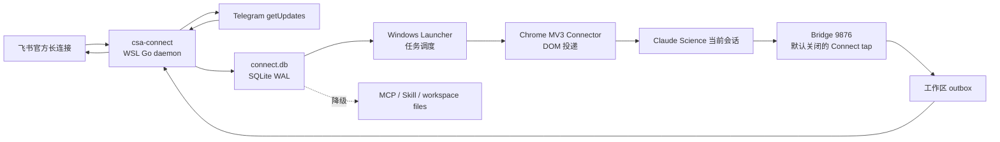

# CSA Connect 双向连接实现与验收

## 1. 产品边界

CSA Connect 是外部聊天与 Claude Science 项目之间的本地消息路由层，不是新的聊天客户端，也不是远程 shell。当前稳定基线支持本人 Telegram 私聊、文本问答、状态查询、自动页面投递、Bridge 自动回传、项目队列，以及 Claude Science 明确引用的 artifact 图片回到 Telegram；安装、下载、SSH、环境修改或外部 Agent 请求只能回传为“等待本地审批”。Telegram 图片进入 Claude Science 的代码和自动测试已完成，真实 Chrome 页面预览仍待人工复验。飞书适配代码存在，但不计入当前 TG-first 实机基线。

## 2. 运行拓扑



- Windows：Tauri/React 面板、DPAPI 凭据、托盘生命周期。
- WSL：锁定版 `csa-connect` Linux 二进制、SQLite、通道长连接、MCP。
- Claude Science：正常路径由浏览器连接器投递、Bridge 捕获本轮回复；原生 Connector、Skill 和工作区文件是降级路径。
- 不开放公网端口，不需要域名、反向代理或云端 relay。

## 3. 技术栈

| 子系统 | 实现 |
| --- | --- |
| Gateway | Go 单文件 Linux x64 二进制 |
| 飞书 | 官方 `larksuite/oapi-sdk-go/v3` WebSocket 长连接 |
| Telegram | 官方 Bot API `getUpdates` / `sendMessage` / `editMessageText` / `sendPhoto` |
| MCP | 官方 `modelcontextprotocol/go-sdk` Streamable HTTP |
| 持久化 | `database/sql` + `ncruces/go-sqlite3` 纯 Go SQLite |
| 桌面端 | Tauri 2 + Rust + React/TypeScript |
| 密钥 | Windows 当前用户 DPAPI；WSL 运行配置权限 `0600` |

参考 `cc2wechat` 的 Channel、Router、Delivery、Session 分层，但不复制其终端和聊天 UI。Multica 只用于参考控制面与本地 runtime 分离，不引入其云后端、PostgreSQL 或多租户架构。

## 4. 消息与权限

消息状态：

```text
received → authorized → bound → queued → claimed
→ replied | needs_local_approval | failed | expired
```

1. 面板生成 10 分钟一次性配对码，只保存哈希。
2. 未配对用户、群聊、未知媒体和重复平台事件不进入队列。入站图片仅允许 JPEG/PNG/WebP，限制 20 MB，并经过 magic bytes 与 SHA-256 校验。
3. 聊天线程使用 `channel + account + sender + conversation + thread` 的稳定哈希路由。
4. 线程必须在本地面板绑定工作区；绑定前消息停在 `authorized`。
5. 聊天端只识别 `/pair`、`/status`、`/help`；其他 `/` 命令不会进入 Claude Science。
6. MCP Bearer Token 只用于 WSL loopback，接口拒绝未知 Origin、超大请求体和无鉴权请求。

## 5. Claude Science 接入

### 5.1 当前自动主路径

1. Launcher 每两秒检查已绑定的 `queued` 消息，并保证同一时刻只有一个有效 claim。
2. 消息以短来源标签和完整 `[CSA#<messageId>]` 关联标记注入当前 Claude Science 页面；长安全说明不再每轮重复。
3. Bridge 只在 `connect_tap_enabled=true` 且存在同 ID 的 `claimed` ack 时聚合该轮回复。
4. Bridge 原子写 outbox，Gateway 扫描后向原 Telegram 线程回送；成功后完成状态并清理 inbox/outbox。
5. 完成后 tap 关闭；同一消息的重复平台事件、旧 progress sequence 和已完成 outbox 都被幂等跳过。

DOM 提交与平台回送使用稳定 task ID 和 `delivery_attempts` 账本。外部结果无法确认时进入 `delivery_unknown`，不会自动盲重发。

### 5.2 Claude Science 图片回到 Telegram

1. Bridge 从最终回复提取 `{{artifact:<uuid>}}`，内部标记不会显示在 Telegram 正文中。
2. Gateway 只读查询 `~/.claude-science/operon-cli.db`，不修改 Claude Science SQLite。
3. 只允许当前远程请求之后生成、位于 `~/.claude-science/artifacts/` 受管根目录内的 JPEG/PNG/WebP。
4. 文件路径、软链接、大小、MIME、magic bytes 与 SHA-256 必须全部通过校验。
5. Telegram 优先使用 multipart `sendPhoto`；明确拒绝时才降级 `sendDocument`。
6. 每张 artifact 使用独立账本阶段；成功后不重复发送，发送结果不确定时停止自动重试。

### 5.3 MCP / Skill 降级路径

面板的“安装 Skill”把 `skills/csa-connect/` 安装到：

```text
~/.claude-science/skills/csa-connect/
```

在 Claude Science 的自定义 Connector 设置中添加：

```text
URL: http://127.0.0.1:9881/mcp
Transport: Streamable HTTP
Authorization: Bearer <面板显示的一次性本机连接信息>
```

降级 MCP 工具固定为：

- `connect_get_status`
- `connect_list_pending`
- `connect_claim_message`
- `connect_send_reply`

不直接写 Claude Science 的 `operon-cli.db`。如果浏览器连接器或 Bridge tap 不可用，可使用 MCP/Skill；如果当前 Claude Science 构建不能注册带 Bearer Header 的 Connector，则使用工作区文件降级，不关闭鉴权换取兼容。

## 6. 文件降级与数据位置

```text
<workspace>/.csa/connect/v1/inbox/<messageId>.json
<workspace>/.csa/connect/v1/ack/<messageId>.json
<workspace>/.csa/connect/v1/outbox/<messageId>.json
```

Gateway 使用原子写入，并把 `/.csa/connect/` 加入仓库本地 `.git/info/exclude`。完成回复后删除 inbox 明文；数据库记录默认保留 30 天。

```text
%APPDATA%/ClaudeScienceAssistant/connect-v2.json
~/.local/share/claude-science-api-bridge/connect/config.json
~/.local/share/claude-science-api-bridge/connect/connect.db
~/.local/share/claude-science-api-bridge/connect/runtime.json
```

Research OS 只读取 `connect.message.received`、`connect.message.queued`、`connect.message.claimed`、`connect.response.sent`、`connect.delivery.failed` 事件元数据。正文必须继续经过 Research OS 的脱敏与同意流程。

## 7. 验收案例

| 编号 | 场景 | 预期 |
| --- | --- | --- |
| C-01 | 飞书/Telegram 配对 | 仅正确且未过期的私聊配对码成功 |
| C-02 | 未绑定线程发消息 | 状态为 `authorized`，聊天端提示本地绑定 |
| C-03 | 完成绑定 | 等待消息转为 `queued`，生成 workspace inbox |
| C-04 | 自动页面投递与 Bridge 回传 | `queued → claimed → replied`，原聊天线程收到回复 |
| C-05 | 需要安装/下载 | 回复状态为 `needs_local_approval`，不执行命令 |
| C-06 | 重复平台事件 | 数据库唯一约束去重，不重复确认或回复 |
| C-07 | Gateway 重启 | Telegram offset、配对、绑定、队列均恢复 |
| C-08 | MCP 不可用 | Skill 使用 workspace inbox/outbox 完成同一消息 |
| C-09 | 窗口关闭 | 应用进入托盘，Gateway 继续；托盘退出时停止 |
| C-10 | 历史清理 | 只清除完成/失败记录，不删除 queued/claimed |
| C-11 | 安全扫描 | 前端状态、日志、进程参数不出现 Secret/Token |
| C-12 | 浏览器链路失败 | 不重复提交；消息保留或进入明确的未知投递状态 |
| C-13 | Claude Science 回复包含 artifact | Telegram 收到正文和一条图片，内部 marker 不显示 |
| C-14 | 同一 artifact outbox 重扫 | delivery ledger 命中 `submitted`，不重复发送图片 |

## 8. 已知边界

Connector 和 Skill 只能在 Claude Science 活跃时领取队列，不能主动唤醒空闲 frame。私有 WebSocket `submitRequest` 只保留为版本锁定的实验接口；在 nonce、Origin、frame 路由和回复捕获全部验证前，`nativeInject` 始终为 `false`。
