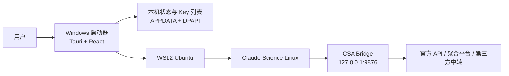

# CSA v0.1.3 GitHub 首页与发布质量设计

状态：设计稿，尚未更新公开 README，尚未创建 v0.1.3 Release。

## 1. 当前审查结论

| 检查项 | 当前结果 | 发布判断 |
| --- | --- | --- |
| v0.1.3 版本号 | launcher、Tauri、Cargo、候选包 manifest 均为 0.1.3 | 通过 |
| 便携包关键文件 | EXE、Bridge、脚本、Skill、文档、Claude Science Linux 二进制均存在 | 通过 |
| ZIP 与 SHA256 | 两个文件均已生成，本地哈希一致 | 通过 |
| API Key 泄漏扫描 | 已跟踪文件和候选包未发现 `sk-...` 形式的 Key | 通过 |
| 自动化测试 | Bridge 51 项、启动器 37 项、桥接回归 9 项通过 | 通过 |
| DeepSeek / MiniMax | 临时 Key 真实连通；DeepSeek 流式、非流式请求成功 | 通过 |
| GitHub 公开 Release | 当前只有 v0.1.1、v0.1.2；v0.1.3 尚未发布 | 待处理 |
| 源码状态 | 37 个已跟踪文件有修改，13 个未跟踪公开候选文件 | 阻断 |
| 候选包 manifest | `sourceTreeDirty=true` | 阻断 |
| GitHub CLI 授权 | 当前未登录 | 推送前处理 |
| README 截图 | `csa-home.png` 仍是旧版五状态栏，当前代码已是可折叠 2 x 3 六状态栏 | 必须更新 |

结论：功能候选包完整，可继续本机验收；在整理提交并从干净提交重新构建之前，不应把当前 ZIP 当作正式 Release。

## 2. GitHub 首页的目标

首页需要在 30 秒内回答五个问题：

1. CSA 是什么，解决什么问题？
2. 它如何桥接 Claude Science 与第三方模型？
3. 新用户从哪里下载和安装？
4. 老用户如何安全升级，是否需要重装环境？
5. 哪些能力经过真实验证，哪些仍有边界？

首页不应把全部实现细节堆在首屏，也不应让用户误以为只下载 EXE 就够了。

## 3. 推荐首页结构

```text
CSA - Claude Science Assistant
一句话定位：Windows 上的 Claude Science 启动器、WSL 运行时编排器与模型 Bridge
[Latest Release] [新手教程] [Claude Science 绿皮书]
版本 / Windows / Tauri / Downloads / License 徽章

真实新版主界面截图（六状态栏 + 当前 Provider）

01 运行原理
Windows 启动器 -> WSL2 Ubuntu -> Claude Science -> CSA Bridge -> Provider

02 选择你的路径
[第一次安装]                       [从旧版升级]
完整 ZIP + AI 体检 + 安装运行时     完整 ZIP 解压到新目录 + 接管 + 验证 + 回退

03 已验证能力
Provider / 协议 / 模型发现 / 真实对话 / 最近验证日期

04 v0.1.3 更新重点
Bridge 接管、窗口不卡死、存储状态、模型空状态、DeepSeek/MiniMax 兼容

05 安全边界与数据位置
DPAPI、WSL 配置、不会修改系统代理、不能跨电脑复制 Key

06 绿皮书联动、故障排查、联系方式、开发者文档
```

## 4. 首屏设计

- 标题使用产品全名 `CSA - Claude Science Assistant`。
- 副标题只说明定位，不堆 Provider 名称。
- 三个首要入口依次为：下载最新版、首次安装、从旧版升级。
- 使用当前真实应用截图，不使用装饰性插画替代产品界面。
- 版本徽章应链接到实际 Release；v0.1.3 Release 创建前，不应把“最新版”写成已经公开发布的 v0.1.3。
- 保留一句透明状态说明，但发布后改为“当前稳定版 v0.1.3”。

## 5. 运行原理应放在安装说明之前



需要紧接着解释：启动器目录是版本文件，用户设置和 WSL 运行时是持久数据，所以升级通常不等于重新安装环境。

## 6. 首次安装与升级必须分成两条路径

| 场景 | 用户需要下载什么 | 是否重装 WSL/Ubuntu | 是否重填 Key | 推荐动作 |
| --- | --- | --- | --- | --- |
| 新电脑且没有 WSL | 完整 ZIP | 需要，经用户明确确认 | 需要 | AI 只读体检后安装 |
| 已有可用 WSL，但首次使用 CSA | 完整 ZIP | 不需要 | 需要 | 安装 CSA WSL 运行时 |
| 同电脑、同 Windows 用户升级 | 完整 ZIP | 不需要 | 通常不需要 | 新目录并排升级并接管 |
| 换电脑或换 Windows 用户 | 完整 ZIP | 视新电脑状态 | 需要 | 按首次安装处理 |
| 只下载新 EXE | 不完整 | 不适用 | 不适用 | 明确禁止作为公开升级方法 |

## 7. 升级原理

CSA 当前是便携应用，不使用 MSI 覆盖安装：

- 版本文件位于每次解压得到的目录，包括 EXE、`proxy.py`、脚本、Skill、文档和内置 Linux 二进制。
- 启动器设置位于 `%APPDATA%\ClaudeScienceAssistant\settings.json`，Key 由当前 Windows 用户的 DPAPI 加密。
- Bridge 配置位于 WSL 用户目录 `~/.claude-science/proxy/config.json`。
- CSA 管理的 Linux 二进制和补丁副本位于 `~/.local/share/claude-science-api-bridge/`。

因此，同电脑同用户升级时，新版会继续读取原有设置，并在启动时检查 9876 端口的 Bridge 是否来自旧目录。用户确认接管后，新版停止旧 Bridge、从新目录启动 Bridge，并验证 `source_path`、健康状态和配置版本。WSL、Ubuntu 和用户数据不应被卸载。

## 8. 推荐升级步骤

1. 关闭旧版 Windows 启动器窗口。
2. 下载完整新版 ZIP 和同名 `.sha256`。
3. 校验 SHA256，将 ZIP 解压到新的版本目录；不要覆盖旧目录。
4. 从新目录打开 `claude-science-assistant.exe`。
5. 先只读检查，再让新版本接管旧 Bridge。
6. 确认六项状态正常、Bridge `source_path` 指向新目录、当前 Key 名称仍存在。
7. 完成一次 Provider 连通测试和一次 Claude Science 对话。
8. 保留旧目录作为短期回退；稳定使用后再删除旧目录。

如果接管失败，应停止新版本并从旧目录恢复，不得注销 WSL、清空 APPDATA 或删除 Key 列表。

## 9. 发布前必须准备的文件

公开仓库：

- `README.md`：按本设计重排，并加入首次安装 / 升级双入口。
- `docs/assets/screenshots/csa-home.png`：重新截取六状态栏版本。
- `docs/assets/screenshots/csa-add-api-key.png`：使用 DeepSeek/MiniMax 已适配后的当前界面重新截取，不含 Key。
- `docs/quick-start.zh-CN.md`：加入场景判断和升级入口。
- `docs/github-release-v0.1.3.md`：补充 DeepSeek `thinking=auto` 兼容修复。
- `docs/provider-access-matrix.zh-CN.md`：写明真实验证日期与协议。
- `docs/prompts/csa-install-or-upgrade-agent-prompt.zh-CN.md`：公开的 AI 安装/升级 Prompt。

Release：

- `claude-science-assistant-v0.1.3-release-portable.zip`
- `claude-science-assistant-v0.1.3-release-portable.zip.sha256`

## 10. 正式发布门槛

1. 审查并提交当前源码改动。
2. 确保 `git status` 干净。
3. 从目标提交重新运行完整测试和 release 构建。
4. 新 manifest 必须记录正确提交且 `sourceTreeDirty=false`。
5. 对重新构建的 ZIP 做秘密扫描、必需文件检查、内置二进制哈希检查。
6. 在候选目录完成 Bridge 接管、流式与非流式真实对话测试。
7. 用户审批 README 预览、Release 文案、资产名称与本地哈希。
8. 恢复 GitHub 授权后再推送源码、标签和 Release 资产。
9. 发布后从 GitHub 下载资产，重新比较文件大小和 SHA256。
