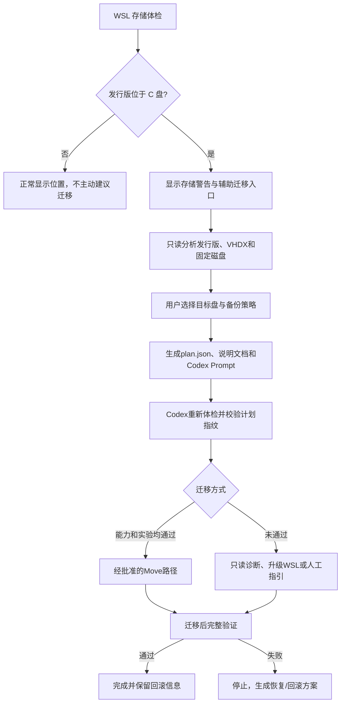

# CSA WSL 存储辅助迁移方案

状态：`DESIGN ONLY / BUILD NO-GO`，尚未实施，禁止据此直接执行迁移

版本：Draft 2（已吸收 2026-07-11 外部审查；仍需 309/VM 实验关闭闸门）

日期：2026-07-11
目标版本建议：v0.1.4（只读诊断与方案生成），后续版本（经实验批准的 Move），v0.2+（另行审查的兼容迁移）

## 1. 目标与边界

当 CSA 检测到所选 WSL2 发行版的虚拟磁盘位于 C 盘时，在“WSL 存储”状态项中提供“辅助迁移”入口。启动器根据本机真实环境生成迁移方案、结构化计划和 Codex Prompt，由 Codex 重新体检、解释风险并在用户逐阶段确认后执行。

迁移对象是整个 WSL2 发行版的虚拟磁盘 `ext4.vhdx`，不是 RAM、Windows 虚拟内存，也不只是 CSA 文件。发行版中可能包含用户的其他项目、数据、密钥和服务，因此第一版不提供无确认、无备份、不可回滚的“一键立即迁移”。

本功能与 CSA 升级严格分轨：

- `就地升级`：保持原发行版和 VHDX 不动，只替换便携包并接管 Bridge 所有权。
- `存储迁移`：移动整个 WSL 发行版的 VHDX，属于独立、高风险、用户主动选择的维护流程。
- C 盘警告不得阻塞普通启动或就地升级；用户可以忽略迁移建议。
- 仅生成计划不得创建迁移执行锁。用户可以安全取消计划并返回就地升级；取消只改变迁移私有状态，不删除备份、不接触 VHDX。

第一版推荐产品名称：

- `辅助迁移`
- `一键生成迁移方案`
- `交给 Codex 安全迁移`

不使用：

- `无风险迁移`
- `一键修复所有空间问题`
- `自动搬走 C 盘所有内容`

## 2. 当前基础

现有代码已经能够：

- 从 `HKCU:\Software\Microsoft\Windows\CurrentVersion\Lxss` 定位发行版 `BasePath`。
- 定位 `ext4.vhdx` 并读取当前文件大小。
- 读取 WSL 宿主盘、Windows 设置盘和 Linux 根分区余量。
- 检测根分区只读、`/tmp`/home 不可写、inode 临界和 Bridge 日志大小。
- 在存储阻断状态下禁止危险的配置写入和服务重启。
- 识别 Bridge `source_path`、旧解压目录实例和当前配置 revision。

现有代码明确不执行 WSL 自动迁移、注销、压缩或重建。本方案是在该安全边界上新增独立工作流，不把迁移混入普通启动流程。

## 3. 产品流程



## 4. 启动器交互

### 4.1 入口条件

满足以下条件时显示“辅助迁移”主入口：

- 目标是 WSL2 发行版。
- 发行版不是 `docker-desktop`、`docker-desktop-data` 或其他明确排除项。
- `BasePath` 可解析且位于 C 盘。
- `ext4.vhdx` 存在。

以下情况只显示诊断，不允许生成可执行计划：

- WSL1。
- `BasePath` 或 VHDX 无法定位。
- 根文件系统只读。
- WSL 命令无响应。
- 发行版状态或注册信息不一致。
- Windows 策略禁止目标目录访问。
- `wsl.exe --help` 未同时声明 `--manage` 与 `--move`。
- 无法识别 WSL 发行通道，或无法获得足以判断能力的版本信息。
- 当前 WSL/Windows 组合不在已完成故障注入的支持矩阵内。
- 目标盘不是本地固定 NTFS 卷，或目标路径包含 reparse point。

上述能力不足时，`plan.json` 必须写 `migrationMethod = "unsupported"`，只生成诊断与升级 WSL 的建议，不生成 Move、Export、Import 或 unregister 命令。

### 4.2 迁移助手展示

| 字段 | 说明 |
| --- | --- |
| 发行版 | 名称、GUID、WSL版本、当前状态 |
| 默认用户 | 只显示用户名，不读取用户文件内容 |
| 当前位置 | Lxss `BasePath` |
| VHDX | 路径、逻辑大小、可获得时显示磁盘占用 |
| 源盘 | 文件系统、总量、余量 |
| 推荐目标盘 | 仅本地固定磁盘，按安全余量排序 |
| 目标目录 | 默认 `<盘符>:\WSL\<发行版安全名称>` |
| 迁移方式 | 经验证的Move / 只读诊断 / 不支持 |
| 备份策略 | 经验证的标准备份 / 不可执行 |
| 预计停机 | 根据VHDX大小标记为估算，不承诺精确时间 |

操作：

- `复制当前路径`
- `选择目标目录`
- `重新分析`
- `生成迁移方案`
- `复制给 Codex`
- `打开方案目录`

不在第一版提供无需外部确认的 `立即迁移`。

## 5. 目标盘选择规则

自动推荐只提供候选，不替用户最终决定。

默认允许：

- Windows 本地固定磁盘。
- 用户当前有写权限的目录。
- 路径不在当前 WSL `BasePath` 内部。
- 路径不包含现有发行版或其他 VHDX。
- Windows 文件系统为 NTFS。ReFS 在独立实验通过前不进入支持白名单。

默认排除：

- 网络盘、映射盘、UNC 路径。
- 可移动盘。
- 光盘、RAM disk和未知类型卷。
- 当前源目录及其子目录。
- `Windows`、`Program Files` 等受系统保护目录。
- 已存在且非空、又不属于本计划的目标目录。
- exFAT、FAT32、ReFS（实验通过前）以及无法识别文件系统的卷。
- 任一目录层级含 junction、symlink 或其他 reparse point 的路径。

空间估算必须区分三个量，不能把 VHDX 的逻辑上限、Windows 文件物理长度和 Linux 已用空间混为一谈：

```text
vhdxPhysicalBytes = Windows 上 ext4.vhdx 的实际文件长度/占用
linuxUsedBytes = WSL 内 df 得到的已用空间
estimatedExportBytes = 基于临时发行版实测校准；未校准前按 max(vhdxPhysicalBytes, linuxUsedBytes)

Move目标盘最低余量 >= max(vhdxPhysicalBytes, linuxUsedBytes) * 1.2 + 15 GB
备份盘最低余量 >= estimatedExportBytes * 1.2 + 5 GB
源盘执行缓冲 >= max(2 GB, vhdxPhysicalBytes * 0.05)
```

如果启用完整导出备份，需要分别计算迁移目标和备份文件空间，不能把同一份余量重复计算。

执行前还必须分别定位 Windows TEMP 与 WSL `swapFile` 所在卷，并将其峰值写入计划。任一阈值无法可靠计算、源盘低于执行缓冲、TEMP 不可写或系统处于重启待办时，不进入迁移执行阶段，只生成清理/重启建议。

## 6. 迁移方式决策

不要仅按版本号猜测能力。必须同时记录 Windows 版本、Store/inbox 发行通道、`wsl --version` 是否可用，以及当前机器 `wsl.exe --help` 是否明确声明 `--manage` 和 `--move`。

微软公开文档目前只明确说明 `wsl --manage` 需要 WSL 2.5+，并未在下列官方页面明确说明 `--move` 的完整语义：

- https://learn.microsoft.com/en-us/windows/wsl/basic-commands
- https://learn.microsoft.com/en-us/windows/wsl/disk-space

因此，`--move` 是否保留发行版名、GUID、默认用户、默认发行版、WSL 版本、稀疏属性，以及失败后原发行版是否完整，均属于待实验假设，不是官方保证。309 和临时 VM 的保留性、跨卷与失败恢复实验完成前，不把它作为公开版默认执行路径。

### 6.1 经实验批准的 Move 路径

适用条件：

- `wsl --manage <Distro> --move <Location>` 在本机帮助中明确可用，且 WSL 版本不低于官方对 `--manage` 的 2.5 门槛。
- 当前 Windows/WSL 组合已进入通过实验的支持矩阵。
- 目标目录通过校验。
- 用户确认停机、目标位置和备份策略。

高层阶段：

1. 重新体检并锁定计划。
2. 停止 CSA 管理的 Claude Science 与 Bridge。
3. 确认没有该发行版内的关键任务仍在运行。
4. 精确终止目标发行版，等待至少 8 秒并确认完全停止；不默认影响其他发行版。
5. 根据用户选择创建备份。
6. 调用官方Move。
7. 重新读取 Lxss `BasePath`，验证注册归属指向目标目录，不用 Windows 文件工具修改 VHDX。
8. 启动并执行完整后验检查。

Move失败时不得自动切换到包含 `unregister` 的兼容路径。应停止、只读检查原发行版注册、BasePath 与启动能力，并生成错误报告。任何半移动或双副本迹象都进入人工恢复状态。

### 6.2 兼容 Export-Import 路径（v0.1.4 禁用执行）

v0.1.4 不生成这条路径的可执行命令，也不因 Move 不可用而自动回退。它只允许在文档中解释风险并建议升级 WSL 或联系人工支持。

可能涉及：

```text
wsl --export
wsl --unregister
wsl --import 或 wsl --import-in-place
```

其中 `unregister` 会删除原发行版注册及其受管理存储，是独立破坏性阶段，必须：

- 先生成完整备份，并在不触碰原发行版的前提下，用临时发行版名和临时目录实际导入验证副本。
- 验证副本可启动、VHD 可挂载、默认用户可恢复、systemd 状态可恢复；“文件存在、大小合理”不是恢复验证。
- 记录发行版名、GUID、WSL版本、默认用户、默认发行版状态、systemd和 `/etc/wsl.conf`。
- `unregister` 永不自动执行；若未来版本考虑支持，必须经过新的安全审查和独立的临门确认。
- 预先生成恢复命令与恢复名称。

未来版本在任何 `unregister` 之前，都必须成功演练临时验证副本，并保存 `/etc/wsl.conf`、实际默认用户、systemd、默认发行版和恢复命令。未经新的对抗性审查和跨机器故障注入测试，启动器不得运行兼容路径。

## 7. 备份策略

计划生成时必须明确选择，不能隐式决定。

### 标准备份（推荐）

- 迁移前导出到用户确认的备份位置。
- 备份目录最好与目标VHDX不在同一个物理故障域。
- 迁移完成后不自动删除。
- 启动器只记录路径、大小、时间和校验状态，不读取发行版文件内容。

### 兼容迁移

- 仅供未来版本设计，v0.1.4 禁用。
- 经过临时导入并成功启动的完整备份是强制条件。
- 未完成恢复演练时禁止进入 unregister 阶段。

v0.1.4 删除“快速无完整备份”模式。是否重新提供必须等待 Move 失败恢复实验与新一轮安全审查。

## 8. 本地计划文件

默认保存位置：

```text
%LOCALAPPDATA%\ClaudeScienceAssistant\MigrationPlans\<plan-id>\
├── plan.json
├── migration-guide.zh-CN.md
├── codex-prompt.txt
└── status.json
```

`plan.json`至少包含：

- schemaVersion、planId、generatedAt、expiresAt。
- Windows版本、WSL版本和Move能力检测结果。
- 发行版名称、GUID、WSL版本、默认用户。
- 是否为Windows默认发行版。
- systemd状态和 `/etc/wsl.conf` 摘要（不含秘密）。
- 当前BasePath、VHDX路径、大小、源盘余量。
- 目标盘类型、文件系统、目标路径、余量。
- 备份模式和备份目标。
- 当前Bridge、Claude Science、端口、source path和revision。
- 迁移方式、阶段、确认点、后验检查和回滚策略。
- 机器/计划指纹。
- 迁移能力来源与证据；未知语义必须显式标记为假设。
- `secretsIncluded=false`。

计划有效期最长 24 小时。指纹至少包含 `distroGuid`、规范化 `BasePath`、VHDX 的 size/mtime/file-id 统计哈希、目标卷序列号、WSL 版本、Move 能力和生成时间。执行器必须在 shutdown、backup、move、postcheck 每个阶段入口重新计算；任一字段漂移立即停止，不能靠聊天上下文豁免。

## 9. Codex执行边界

生成的 Prompt 必须要求 Codex：

1. 先读取本地plan和本项目安全规则。
2. 重新进行只读体检。
3. 不因计划存在就视为用户已批准迁移。
4. 列出将停止的服务、目标路径、备份方式、空间和回滚方法。
5. 等用户明确确认后只执行一个阶段。
6. 每阶段完成后写 `status.json` 并重新验证。
7. 任何状态漂移、未知输出、超时或非零退出码立即停止。
8. 不自动执行 unregister，不自动删除备份，不自动清理旧数据。
9. 不输出API Key、token、Cookie、完整Prompt或用户文件内容。
10. 不修改Clash、VPN、DNS、hosts、系统代理、证书或端口443。
11. 不把 API Key 写入计划、Prompt、日志或诊断包。
12. 迁移计划没有经过实验支持矩阵批准时，只报告 `unsupported`，不得自行尝试未记录命令。

## 10. 状态机

建议状态：

```text
not_needed
eligible
plan_generated
cancelled_before_mutation
awaiting_preflight_confirmation
preflight_verified
awaiting_shutdown_confirmation
backup_in_progress
backup_verified
awaiting_move_confirmation
move_in_progress
postcheck_in_progress
completed
failed_original_intact
failed_recovery_required
rollback_available
rollback_in_progress
rolled_back
```

`plan_generated` 和 `preflight_verified` 可安全取消到 `cancelled_before_mutation`；取消只封存计划，不删除任何文件。真正进入停机/备份/Move 前才创建机器级执行锁。

执行锁建议位于 `%ProgramData%\ClaudeScienceAssistant\migration.lock`，内容包含 planId、distroGuid、PID、Windows 用户与创建时间，通过独占文件句柄原子获取。另一个用户或 Agent 获取失败时只能显示操作者和只读状态，不得强制接管。迁移执行锁存在时拒绝升级接管、Provider 切换、Bridge 重启和卸载；但必须提供回到原操作者会话处理或只读恢复指导。仅存在未执行计划时不阻塞普通启动和就地升级。

## 11. 后验验证

迁移完成不能只看命令退出码，必须检查：

- 发行版名称、GUID和WSL2版本符合计划。
- Lxss `BasePath` 指向目标目录。
- 目标 `ext4.vhdx` 存在且可访问。
- 默认发行版状态未意外改变，或已按计划恢复。
- 默认Linux用户未变成root。
- systemd状态符合迁移前记录。
- Linux根分区、`/tmp`和用户home可写。
- CSA managed binary、patched copy、venv和配置存在。
- WSL配置权限仍为 `0600`。
- Bridge在9876健康，`source_path`属于当前CSA包。
- Claude Science在8765/8766可用。
- 配置revision一致。
- C盘余量相对迁移前合理增加。
- 精确终止后等待至少 8 秒，再按 Stopped -> Starting -> Running 顺序验证发行版与服务。
- 只读确认 Lxss 注册归属唯一；原位置是否残留 VHDX 只作信息项，不作为自动删除或直接访问条件。

模型API请求不是存储迁移的默认后验检查，避免无意产生费用。仅在用户明确要求时做短请求。

## 12. 回滚原则

- Move失败且原发行版仍注册可用：不做额外破坏性操作，恢复原服务。
- Move成功但CSA失败：先区分CSA配置问题与发行版损坏，不立即反向迁移。
- 需要移回：生成新的反向迁移计划并再次确认。
- 兼容路径失败：保留导出文件，在恢复名称下导入，验证后再讨论名称整理。
- 不自动删除备份、旧目录或恢复发行版。
- 不以修改Lxss注册表代替官方WSL命令。
- Export/Import 后必须通过 `/etc/wsl.conf` 的 `[user] default=` 恢复导入发行版默认用户，并在 terminate + 至少 8 秒后用 `id -un` 验证；不能依赖发行版 launcher 的 `config --default-user`。

## 13. 安全与对抗性要求

- 所有 PowerShell 与 WSL 调用使用参数数组、标准输入 JSON 或强类型参数，不把发行版名和路径插入脚本文本。
- 发行版名称除兼容已有合法名称外，新建临时名称限制为 `^[A-Za-z0-9._-]+$`。
- 使用 `GetFullPath` 和 reparse-point 检测逐段解析目标路径；任一层含 junction/symlink/reparse point 默认拒绝。
- 解析后的目标路径不得等于源 BasePath、不得位于其子树，也不得反向包含源路径。
- 发行版名称、用户名和卷标签视为不可信输入。
- 执行前后检查计划指纹，降低TOCTOU风险。
- 使用进程级超时、退出码和结构化stdout；不根据本地化文本判断成功。
- 迁移日志不包含秘密或用户文件列表。
- 权限提升必须显式，不以管理员身份运行整个启动器作为默认方案。
- 迁移脚本只能操作用户明确选择的一个发行版。
- 任何fallback不得扩大操作范围。

## 14. 代码拆分建议

### v0.1.4：只读辅助迁移

- Rust：`inspect_wsl_migration`、`generate_wsl_migration_plan`、`get_migration_status`。
- React：WSL存储状态入口、目标盘选择、方案预览、复制Prompt。
- Skill：只读迁移检查、方案schema、官方Move执行指导、回滚参考。
- Scripts（只读）：
  - `inspect-wsl-migration.ps1`（只读）
  - `verify-wsl-migration.ps1`（只读）
  - `plan-wsl-migration-recovery.ps1`（只生成恢复计划）

第一版不内置 Move 或 Export-Import 执行器。309/VM 实验与支持矩阵批准后，再单独评审 `invoke-wsl-move-approved.ps1`。

### v0.2：应用内自动工作流

- 持久化迁移状态机。
- 崩溃/重启后的恢复入口。
- 完整备份管理。
- 兼容路径执行器（通过额外安全评审后）。
- 应用内进度和一键生成反向回滚计划。

## 15. 测试矩阵

环境：

- Windows 10 19045 + Ubuntu-22.04。
- Windows 11 + Ubuntu-24.04。
- Store WSL 与 Windows inbox WSL。
- WSL帮助包含/不包含Move。
- systemd开启/关闭。
- C→D、C→E、C→H。
- 路径含空格、中文和长路径。
- BitLocker已解锁固定卷。
- NTFS、ReFS、exFAT（后两者应在未批准时明确降级/拒绝）。
- 两个 Windows 用户与两个 Agent 并发。

失败注入：

- 目标盘空间不足。
- 目标目录不可写/非空。
- WSL只读。
- Bridge或Claude Science无法停止。
- `wsl --shutdown`超时。
- Move返回非零。
- 迁移途中进程被杀/应用关闭/Windows重启。
- 迁移后默认用户变成root。
- systemd服务路径仍指旧CSA目录。
- 目标VHDX存在但发行版无法启动。
- 计划生成后VHDX、BasePath或目标余量变化。
- 生成计划后放弃迁移并继续就地升级。
- Move 后出现原路径残留或两份 VHDX 的只读识别。
- 截断/损坏导出文件，必须在 unregister 前被临时导入验证拦截。

验收：

- 不发生静默unregister。
- 失败时能准确说明原发行版是否完整。
- 不输出秘密。
- 迁移完成后CSA全链路恢复。
- 回滚方案不依赖聊天上下文。

## 16. Build Gate 与实验清单

当前决定：

1. v0.1.4只做只读体检、风险说明、不可执行方案和 Codex Prompt；不在启动器或 Prompt 中直接运行迁移。
2. 快速无备份模式关闭；Export-Import 执行推迟到 v0.2+ 的独立审查之后。
3. 目标盘首版只允许本地固定 NTFS；ReFS 待实验，exFAT/FAT32拒绝。
4. 计划最长有效 24 小时，可由用户安全封存/删除；删除计划不等于删除备份或 VHDX。
5. 允许分析非 CSA 专用发行版，但 UI 必须明确说明会影响整个发行版。

进入 Move Build 前必须完成：

- 在 309 的 Win10 19045 + Ubuntu-22.04 与临时 Win11 + Ubuntu-24.04 发行版上验证 `--move` 能力、权限、跨卷和失败语义。
- 记录迁移前后发行版名、GUID、默认用户、默认发行版、systemd、WSL 版本、BasePath、VHDX 与 sparse 属性。
- 注入目标盘不足、权限拒绝、进程中断、Windows 重启与跨卷 `E_ACCESSDENIED`。
- 验证“无能力机型”只降级，不生成可执行计划。
- 验证生成计划后可以安全取消并完成就地升级。
- 对新执行器再做一次只读安全审查，并获得用户明确批准。

## 17. 外部审查整改追踪

| 发现 | Draft 2 处理 | 状态 |
| --- | --- | --- |
| P0-1 Move官方语义不足 | 标为实验假设，加入官方链接与实验闸门 | 设计已改；待实验 |
| P0-2 备份不等于可恢复 | 兼容路径禁用，未来要求临时导入验证 | 设计已改；待未来审查 |
| P0-3 跨机器泛化 | 增加Store/inbox与unsupported降级分支 | 设计已改；待309/VM测试 |
| P0-4 升级与迁移耦合 | 两条路径分轨，计划可安全取消 | 设计已改；待交互测试 |
| P0-5 双副本与8秒规则 | 注册归属只读闭环，加入terminate+8秒 | 设计已改；待实验 |
| P1-1/P1-2 空间估算 | 分离物理占用、Linux已用、备份和TEMP/swap | 设计已改；阈值待校准 |
| P1-3 快速无备份 | v0.1.4删除 | 已关闭 |
| P1-4 文件系统 | 首版仅NTFS | 设计已关闭 |
| P1-5 指纹TOCTOU | 定义字段、24小时与阶段重算 | 设计已改；待测试 |
| P1-6 默认用户/systemd | 定义wsl.conf恢复与实际用户验证 | 设计已改；兼容路径仍禁用 |
| P1-7/P1-8 命令与路径注入 | 结构化传参、reparse拒绝与路径关系校验 | 设计已改；待实现审查 |
| P1-9 跨用户锁 | 定义ProgramData机器锁与原子互斥 | 设计已改；待权限实验 |

Build Gate 仍为 `NO-GO`。上表“待实验/待测试”项关闭并经复审前，不实现迁移执行器。
