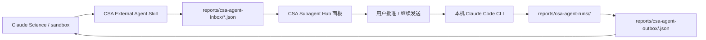
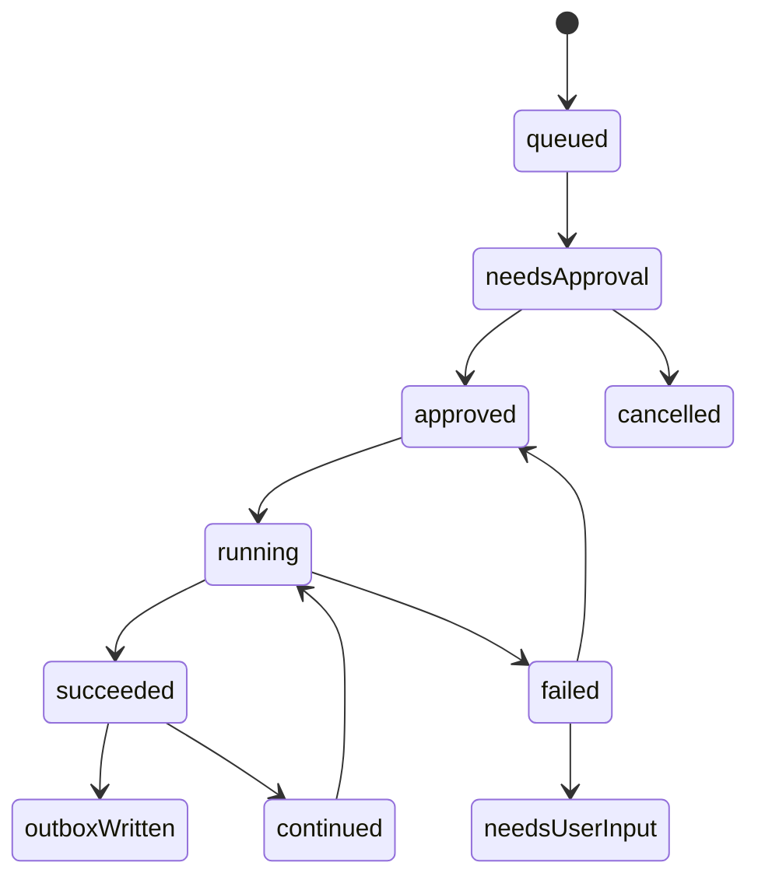

# CSA Subagent Hub 可用级产品规划

本文用于把当前“技术链路能跑”的 Subagent Hub，推进到“用户真的能用”的版本。核心判断：当前版本只能证明 `文件收件箱 -> 面板批准 -> Claude Code -> result.json` 这条链路可行，但还不是可用产品。

## 1. 当前问题判断

当前功能属于 demo 级，主要问题不是某一个 bug，而是产品闭环不完整：

1. Claude Science 不知道何时应该求助外部 Agent。
2. 面板只能看到 request 和一次运行结果，缺少完整任务状态。
3. `result.json` 对人和 Claude Science 都不够友好，缺少稳定 outbox。
4. 运行失败后没有明确的恢复路径，例如 CLI 未登录、session 丢失、JSON 无效、权限不足。
5. 会话续跑已经打通，但还不像一个任务管理器，没有清晰的任务列表、状态、日志、继续输入、结果回填。
6. 自动模式只有字段预留，没有策略、风险等级、预算和可回滚边界。
7. UI 信息密度和操作顺序还不够清楚，用户不知道下一步该点哪里。

因此，下一阶段目标不是继续堆更多 Agent，而是把一个最小场景打磨到可用：

> Claude Science 遇到卡点后，能通过 Skill 投递请求；CSA 面板能稳定接住、展示、批准、运行、续聊、回写结果；Claude Science 能读回结果继续工作。

## 2. 可用级定义

一个可用级 Subagent Hub 至少满足以下条件：

| 维度 | 可用标准 |
|---|---|
| 入口 | Claude Science 能通过 Skill/脚本一条命令投递请求 |
| 可理解 | 面板能用中文清楚显示任务类型、来源、风险、状态、下一步 |
| 可控制 | 默认手动批准；用户能取消、重试、继续会话 |
| 可追踪 | 每个任务有 taskId/runId/sessionId/status/timeline |
| 可恢复 | CLI 未登录、失败、超时、JSON 错误都有明确提示 |
| 可回写 | 外部 Agent 结果写入稳定 outbox，Claude Science 可读取 |
| 可扩展 | 低风险自动模式有策略入口，但第一阶段不默认开启 |

## 3. 推荐总体架构

第一阶段继续坚持轻量路线，不上完整多 Agent 平台。



关键原则：

- Claude Science 只负责识别卡点和投递请求，不直接执行宿主机命令。
- CSA 面板是审批和任务中枢。
- 外部 Claude Code 是执行者。
- outbox 是结果回传接口，不让 Claude Science 去猜 run 目录。

## 4. CSA External Agent Skill 设计

这个 Skill 的目标不是让 Claude Science 获得宿主机权限，而是让它知道：

1. 什么情况应该求助外部 Agent。
2. 如何生成脱敏 request。
3. 如何读取 outbox 结果。
4. 如何在结果不足时继续补充信息。

### 4.1 Skill 触发场景

Skill 应指导 Claude Science 在以下场景使用外部求助：

- 数据集下载失败、网络受限、沙盒内无法访问目标地址。
- 环境安装失败、依赖解析失败、编译失败。
- VM/SSH/GPU 检测需要宿主机信息。
- WSL/VHDX/磁盘迁移扫描需要宿主机可见能力。
- 需要把当前卡点交给更强的本机 Agent 诊断。

### 4.2 Skill 不允许做的事

第一版 Skill 必须明确禁止：

- 不直接调用宿主机 Claude Code。
- 不写入 API Key、token、完整 `.env`、cookie、私钥。
- 不投递删除、格式化、迁移、安装等高风险执行请求。
- 不绕过 CSA 面板审批。
- 不假设 request 已经被执行；必须读取 outbox 确认状态。

### 4.3 Skill 内置资源

建议 Skill 包含：

```text
csa-external-agent/
  SKILL.md
  scripts/
    submit-csa-request.ps1
    submit-csa-request.sh
    read-csa-result.ps1
    read-csa-result.sh
  references/
    request-schema.md
    safety-policy.md
    task-kinds.md
```

### 4.4 最小 Skill 工作流

```text
1. 判断当前问题是否属于 dataset/environment/vm/migration/custom。
2. 整理脱敏 note，只保留目标、错误摘要、已尝试步骤。
3. 调用 submit-csa-request 写入 inbox。
4. 告诉用户：已提交到 CSA 面板，等待批准。
5. 轮询或手动读取 outbox。
6. 读取 result summary 后继续任务。
```

## 5. 文件接口规划

### 5.1 inbox：请求入口

路径：

```text
reports/csa-agent-inbox/<requestId>.json
```

建议 schema：

```json
{
  "schemaVersion": 1,
  "requestId": "dataset-20260715-001",
  "source": "claude-science",
  "taskKind": "dataset",
  "title": "数据集下载失败",
  "cwd": "C:\\path\\to\\workspace",
  "note": "脱敏错误摘要",
  "requestedAction": "diagnose",
  "approvalMode": "manual",
  "policyId": "manual-only",
  "createdAt": "2026-07-15T00:00:00Z"
}
```

### 5.2 runs：运行留痕

路径：

```text
reports/csa-agent-runs/<runId>/
```

必须包含：

```text
request.json
prompt.md
stdout.txt
stderr.txt
result.json
timeline.jsonl
```

### 5.3 outbox：给 Claude Science 读的结果

路径：

```text
reports/csa-agent-outbox/<requestId>.json
```

建议 schema：

```json
{
  "schemaVersion": 1,
  "requestId": "dataset-20260715-001",
  "status": "completed",
  "latestRunId": "dataset-20260715-001-1784...",
  "sessionId": "claude-session-id",
  "resultPath": "reports/csa-agent-runs/.../result.json",
  "summary": "外部 Agent 已完成诊断，建议先校验 URL 和目标目录。",
  "nextAction": "read_result",
  "updatedAt": "2026-07-15T00:10:00Z"
}
```

outbox 是让 Claude Science 可用的关键。没有 outbox，它只能猜哪个 run 是最新结果。

## 6. 面板信息架构

Subagent Hub 应从当前“小卡片 demo”升级为任务管理器。

### 6.1 顶部概览区

显示：

- 待批准任务数。
- 运行中任务数。
- 失败任务数。
- 最近完成任务。
- Claude Code CLI 状态：未安装 / 未登录 / 可调用 / 调用失败。

按钮：

- 刷新。
- 新建测试请求。
- 打开 inbox。
- 打开 runs。
- 打开 outbox。

### 6.2 左侧任务列表

每条任务显示：

- 状态 badge：待批准 / 运行中 / 完成 / 失败 / 需继续 / 已取消。
- taskKind：dataset/environment/vm/migration/custom。
- 标题。
- 来源。
- 创建时间。
- 风险等级。

支持筛选：

- 全部。
- 待批准。
- 失败。
- 已完成。
- 最近 24 小时。

### 6.3 右侧任务详情

分成 5 个 tab 或折叠块：

1. 请求：request 原文、脱敏 note、cwd、taskKind。
2. 审批：风险等级、将要调用的 Agent、预计动作、批准按钮。
3. 会话：sessionId、继续发送框、历史续跑记录。
4. 结果：summary、stdout/stderr、result.json 路径。
5. 回写：outbox 状态、Claude Science 是否已读取。

### 6.4 底部操作区

按钮必须清晰：

- 批准运行。
- 继续发送。
- 重试本次运行。
- 复制 Prompt。
- 打开结果目录。
- 写入 outbox。
- 取消任务。

第一版不需要做美观复杂，但必须让用户知道：

1. 现在任务处于什么状态。
2. 下一步能做什么。
3. 出错后该如何恢复。

## 7. 任务状态机

建议引入明确状态：

```text
queued
needsApproval
approved
running
succeeded
failed
needsUserInput
continued
cancelled
outboxWritten
```

状态变化：



没有状态机，UI 会永远像临时 demo。

## 8. 自动模式设计预留

自动模式不能直接从“能跑”跳到“全自动”。建议分三级：

| 模式 | 含义 | 第一阶段 |
|---|---|---|
| manual | 用户手动批准每次运行 | 默认启用 |
| assisted | 低风险任务可自动生成计划，但执行前仍确认 | 可做开关 |
| auto | 低风险白名单任务自动运行 | 暂不启用 |

auto 必须满足：

- taskKind 在白名单。
- cwd 在允许目录。
- prompt 不包含敏感字段。
- request 大小受限。
- 单次运行有超时。
- 每日预算/次数受限。
- 结果必须写 timeline。
- 用户可一键关闭自动模式。

## 9. 可用级开发阶段

### 阶段 A：修好任务闭环

目标：让 Claude Science 能投递、面板能执行、结果能回读。

任务：

1. 新增 outbox。
2. 每次 run 完成后写 outbox。
3. 增加 `read-csa-result` 脚本。
4. 增加任务状态字段。
5. UI 显示状态和结果摘要。

验收：

- Claude Science 投递 request 后，用户能在面板批准。
- 外部 Agent 完成后，Claude Science 能读取 outbox 并继续。

### 阶段 B：做 CSA External Agent Skill

目标：让 Claude Science “知道可以求助”。

任务：

1. 写 `SKILL.md`。
2. 打包 submit/read 脚本。
3. 写 request schema 和安全策略。
4. 在一个 dataset 失败案例中测试。
5. 在一个 environment 失败案例中测试。

验收：

- Claude Science 能主动判断卡点。
- 能生成脱敏 request。
- 不泄露 key/env/token。
- 能读取 outbox 继续任务。

### 阶段 C：任务管理 UI 可用化

目标：让面板像一个小型 CI/任务中枢。

任务：

1. 任务列表加状态和筛选。
2. 任务详情分区。
3. 增加 timeline。
4. 增加重试、取消、打开目录。
5. 增加 CLI 状态检查。

验收：

- 用户不用看文件夹也能判断任务是否成功。
- 失败时 UI 告诉用户下一步。
- 续跑会话历史可见。

### 阶段 D：低风险 assisted 模式

目标：为未来自动化铺路，但不直接全自动。

任务：

1. policyId 规则。
2. 风险等级计算。
3. assisted 开关。
4. 低风险任务自动生成计划，执行前确认。

验收：

- 用户能看到为什么该任务被判为低/中/高风险。
- 没有任何高风险命令会自动执行。

## 10. 第一批必须修的 bug/缺口

优先级从高到低：

1. outbox 缺失，Claude Science 无法稳定读回结果。
2. 任务没有状态机，UI 不知道任务生命周期。
3. 失败原因没有分类，例如 CLI 不存在、未登录、超时、session 无效。
4. 会话续跑没有持久化为统一 task timeline。
5. 面板没有“打开目录/复制路径/复制 Prompt”等恢复按钮。
6. request/outbox schema 没有版本化校验。
7. 自动模式字段存在但 UI 没有解释，容易误导用户。
8. Skill 还没做，Claude Science 不会主动求助。

## 11. 下一步建议

不要继续先做远程微信/飞书，也不要先上完整多 Agent 平台。下一步只做一个闭环：

```text
CSA External Agent Skill
-> 写 inbox
-> 面板批准运行
-> Claude Code 返回 session/result
-> 写 outbox
-> Claude Science 读取 outbox
-> 继续任务
```

这个闭环跑通后，Subagent Hub 才从“能调用外部 Agent”升级为“Claude Science 真的能使用外部 Agent”。
